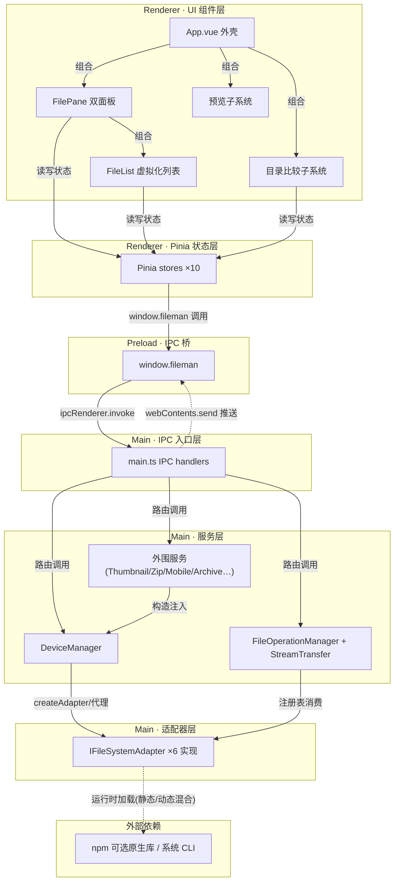
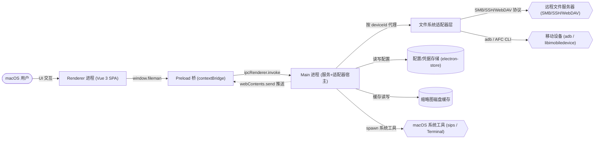
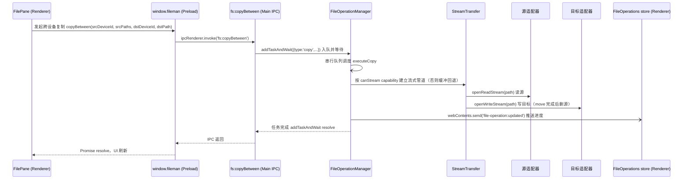

# FilemanElectron 架构总览

## 一、评估范围

- **范围档位**：`app`（完整应用）· 根路径 `/Users/wtb/work_space/FilemanElectron`（仓库根）。
- **覆盖文件集合**：约 105 个源文件、~24,000 行代码（见 frontmatter `covered_files`，40 个显式声明的文件/目录）。三大区域：
  - **主进程** `electron/`（main.ts 546 行 + preload.ts + 7 个适配器 + 17 个服务，~6,600 行 TS）
  - **渲染进程** `src/`（36 个 .vue 组件 + 10 个 Pinia store + utils/composables，~17,200 行）
  - **e2e** 1 个 Playwright spec（121 行，覆盖但不评估）
- **多语言技术栈与精度**：
  - TypeScript（~11,800 行）— **high**：显式 import + 类型系统，依赖边逐条核实
  - Vue 3 SFC（36 个，~11,900 行）— **medium**：`<script setup>` import 已核实，template 层仅抽样
  - JavaScript（native/iosafc/index.js，4 行 stub）— **low**，规模可忽略
- **一句话架构职责**：macOS 双面板多标签文件管理器，以统一适配器层（IFileSystemAdapter）在 Electron 三进程架构中浏览与操作本地及远程文件系统（SMB/SSH/Android/iOS/WebDAV），内置目录比较、文件 diff、富媒体预览与跨设备传输。

## 二、整体档位

## 🔵 良（偏高）

**汇总依据**：4 维均为「良」——地基维度（layering / cohesion）健康无系统性偏离，无任何维度达到「中/差」，按多数原则汇总为「良」；其中适配器抽象（extensibility）与三进程隔离（layering）局部接近「优」，但入口层承载业务规则、IPC 契约三处平行声明等差距使其止步于「良」。

**一句话总评**：这是一个分层纪律与扩展抽象都做得相当扎实的 Electron 应用——最值得肯定的是「适配器 + 能力声明」双抽象把 6 种异构文件系统收敛为统一端口；最需留意的是 IPC 契约三处手工同步与 DeviceManager 职责持续汇聚的趋势。

## 三、3 视角架构图

### 视角① 分层 / 模块依赖

<!-- generated:layering -->

**关键节点/边证据**：

| 节点/边 | 证据 | 说明 |
|---|---|---|
| bridge（唯一暴露点） | `electron/preload.ts:384` | `contextBridge.exposeInMainWorld('fileman')`，配 `electron/main.ts:65` 的 `contextIsolation:true` |
| stores → bridge | `src/stores/devices.ts:122` | 状态层经 `window.fileman.getDevices()` 走 IPC，无 Node 直连 |
| bridge → ipc | `electron/preload.ts:172` | `ipcRenderer.invoke` 通道调用 |
| ipc ⇢ bridge（反向推送） | `electron/main.ts:453` | `webContents.send('device:changed')` 推送事件（虚线，数据推送非依赖） |
| devmgr → adapters | `electron/src/services/DeviceManager.ts:448` | `createAdapter` 按 device.type 分发 |
| adapters ⇢ extdeps | `electron/src/adapters/AndroidAdapter.ts:26` 等 | 可选依赖运行时加载（虚线），策略静态/动态混合（详见 RISK-05） |

依赖方向总体单向（UI → 状态 → 桥 → IPC 入口 → 服务 → 适配器 → 外部），未发现反向或循环依赖证据；唯一「下行例外」是 main→renderer 的事件推送（架构上合法的回推通道）。

### 视角② C4 Container（level=container）

shape 图例：圆角=服务/容器、矩形=组件、圆柱=存储、双斜角=外部系统、圆角括号=人。

<!-- generated:c4 -->

**关键组件证据**：Renderer 入口 `src/main.ts:1`（createApp+Pinia，无 router）；Preload `electron/preload.ts:384`；Main 服务装配 `electron/main.ts:22-35`（13 个服务单例）；适配器端口 `electron/src/adapters/types.ts:33`；配置存储 `electron/src/services/ConfigService.ts:25`（electron-store）；移动 CLI 打包路径 `electron/src/services/ToolPathResolver.ts:14`（extraResources bundled adb）；系统工具 `electron/src/services/ImageDecodeService.ts:1`（execFile 调 sips）、`electron/main.ts:110`（osascript Terminal）。

### 视角③ 运行时 / 数据流（典型主链路：跨设备复制）

<!-- generated:runtime -->

**流转步证据**：① preload 桥 `electron/preload.ts:224` → ② main 入口 `electron/main.ts:294` → ③ 入队 `electron/main.ts:301` / `electron/src/services/FileOperationManager.ts:803`（addTaskAndWait）→ ④ 队列执行 `FileOperationManager.ts:291`（executeCopy）→ ⑤ 策略选择 `FileOperationManager.ts:18`（canStream 门控，注释显式引用 OCP）→ ⑥⑦ 流式端口 `electron/src/adapters/types.ts:67-68` → ⑧ 进度推送 `src/stores/fileOperations.ts:43`（onFileOperationUpdated 订阅）。

## 四、4 维正向总评

### 维度：分层 & 依赖方向 · 档位 良

- **现状**：三进程物理分层清晰——renderer 组件经 Pinia stores 到 `window.fileman` 单向下行（`src/stores/devices.ts:122`），preload 是唯一暴露点且 contextIsolation 生效（`electron/preload.ts:384`、`electron/main.ts:65`）；主进程内 IPC 入口 → 服务层 → 适配器层依赖单向、无循环证据。差距：`main.ts` 集中注册约 60 个 handler 且承载 ZIP 虚拟路径（`::` 约定）解析等业务规则（`electron/main.ts:37-47`、`electron/main.ts:177-194`），入口层越位；IPC 契约在 main.ts / preload.ts / src/env.d.ts 三处手工平行声明。
- **业界成熟做法（对照）**：分层架构要求上层依赖下层、依赖单向不反向不循环，入口层只做转发与协议适配；适用前提是职责可清晰分层的应用，Electron 社区惯例是 main 入口做 IPC 路由、业务下沉 service 模块。现状与标杆的差距：进程间分层与层间依赖接近标杆；差距在入口层同时承担路由注册与业务规则，及 IPC 三处同步的跨层负担。
  - provenance：LLM内置经验 · 未核对 · 延伸阅读：Layered Architecture 经验模式；《Clean Architecture》Robert Martin 依赖规则；Electron 安全清单 contextIsolation
- **档位依据**：与业界做法差距为局部（入口层一处越位）而非系统性，不影响整体可演进性，证据强度高（file:line 实锤）→ 良。

### 维度：职责内聚 & 边界 · 档位 良

- **现状**：适配器层是内聚典范——IFileSystemAdapter 统一 19 个文件系统操作 + 可选流式方法（`electron/src/adapters/types.ts:33-69`），DeviceCapabilities 按 6 种设备声明能力差异（`electron/src/adapters/capabilities.ts:41-172`），UI 按 capability 门控。差距：DeviceManager（703 行）同时承担设备注册、连接生命周期、移动发现代理、能力兜底、文件操作代理五类职责，且构造函数自动启动扫描（`electron/src/services/DeviceManager.ts:88`）；渲染层存在巨型组件（FileList.vue 1545 行、PreviewTextContent.vue 1372 行）。
- **业界成熟做法（对照）**：单一职责 + 信息隐藏 + 端口-适配器模式，一个模块只有一个变化的理由；适用前提是通用场景，多外部设备/协议接入时端口-适配器是常见组织方式。现状与标杆的差距：适配器层与能力门控接近标杆；DeviceManager 多职责汇聚与个别巨型组件属局部偏离，不构成系统性问题。
  - provenance：LLM内置经验 · 未核对 · 延伸阅读：SOLID·SRP（Robert Martin）；Hexagonal Architecture（Alistair Cockburn）；Parnas 信息隐藏
- **档位依据**：核心边界（适配器层）达到标杆水平，偏离集中在单一服务类与个别组件，影响面局部、可演进 → 良。

### 维度：可扩展性 & 可变性 · 档位 良

- **现状**：主扩展轴（新增设备类型）设计到位——新设备 = 实现 IFileSystemAdapter + 声明 capabilities + 在 `createAdapter` switch 加一个 case（`electron/src/services/DeviceManager.ts:448-495`），fs:* 通道按 deviceId 通用路由无需新增通道；可选依赖运行时加载实现优雅降级（`AndroidAdapter.ts:26` createRequire、`SSHAdapter.ts:38` 动态 import、`iOSAdapter.ts:42` require 候选路径）；传输策略按 canStream 选择且注释显式引用 OCP（`FileOperationManager.ts:18`）。差距：新增设备仍需改 switch 与 type union（约 4 处触点）；可选依赖加载策略不统一（SMB 为顶层静态 import `SMBAdapter.ts:2`）；未见过度设计。
- **业界成熟做法（对照）**：开闭原则 + 策略/注册表扩展——新增能力靠新增实现类并在工厂/注册表登记；可选依赖用运行时加载与能力探测做优雅降级；适用前提是变化方向明确可枚举，YAGNI 约束下不为想象规模提前抽象。现状与标杆的差距：接近标杆，差距在 switch-case 分发与加载策略不一致，设备类型继续增多时触点线性增长。
  - provenance：LLM内置经验 · 未核对 · 延伸阅读：SOLID·OCP（Robert Martin）；GoF Factory Method / Registry；Twelve-Factor App 依赖与配置分离
- **档位依据**：接口 + 能力 + 通用路由使扩展成本为局部增量，接近开闭原则标杆；switch 分发与策略不一致是明确但可控的差距，当前 6 种设备规模下属「小差距不影响健康」→ 良。

### 维度：可读性 & 命名表意 · 档位 良

- **现状**：结构自解释——目录即架构（adapters/services/stores/components/compare/preview/types/utils），IPC 通道命名空间化（`electron/main.ts:99` 起 system:/config:/device:/fs:…），命名高度表意（IFileSystemAdapter、StreamTransfer、FileOperationManager 直呼其职）；『疑难问题解决记录/』把架构级陷阱文档化为权威记录。差距：DeviceManager 名字未体现移动发现代理职责；package.json 依赖 vue-router 但 renderer 不使用（`src/main.ts:1` 仅 createApp+Pinia），存在误导性残留；巨型 SFC 降低单文件结构可读性（`src/components/FileList.vue:257` 起 script 入口，全文 1545 行）。
- **业界成熟做法（对照）**：语义命名 + 约定优于配置——名字反映职责、同类事物一致组织，依赖清单与实际架构一致不留误导残留；适用前提通用，长期演进的多人项目尤为受益。现状与标杆的差距：命名与目录约定接近标杆；差距在个别名实不完全对齐、依赖残留与巨型单文件的结构噪音。
  - provenance：LLM内置经验 · 未核对 · 延伸阅读：《代码整洁之道》命名（Robert Martin）；Rails Convention over Configuration；DDD Ubiquitous Language（Eric Evans）
- **档位依据**：结构与命名总体达到「一眼建立心智模型」的水平，偏离为个别残留与噪音，非系统性 → 良。

## 五、亮点（Highlights）

- **HL-01 适配器 + 能力声明双抽象**（extensibility）：IFileSystemAdapter 统一端口 + 六套 DeviceCapabilities 把设备差异从散落 if-else 收敛为声明式数据，UI 按 capability 门控，新设备接入不改既有分发逻辑。证据：`electron/src/adapters/types.ts:33`、`electron/src/adapters/capabilities.ts:41`。
- **HL-02 Electron 安全基线落实到位**（layering）：contextIsolation + nodeIntegration:false + 唯一 `window.fileman` 暴露点，进程间依赖方向被机制而非纪律约束。证据：`electron/preload.ts:384`、`electron/main.ts:65`。
- **HL-03 可选原生依赖运行时加载**（cohesion）：adbkit/ssh2/iosafc 以 createRequire/动态 import 加载，缺依赖只禁用对应设备类型而非崩溃；移动 CLI 经 ToolPathResolver 统一解析打包内路径。证据：`electron/src/adapters/AndroidAdapter.ts:26`、`electron/src/adapters/iOSAdapter.ts:42`、`electron/src/services/ToolPathResolver.ts:8`。
- **HL-04 IPC 通道命名空间化 + 踩坑记录文档化**（readability）：60 余个通道按前缀一眼归类，filemanAPI 方法与通道一一对应；『疑难问题解决记录/』是低成本高回报的可读性资产。证据：`electron/main.ts:171`、`electron/preload.ts:170`。

## 六、风险点（Risks）—— 总览级、前瞻性

- **RISK-01 IPC 契约三处平行声明的同步漂移风险**（layering）：同一 IPC 形状在 main.ts handler、preload.ts filemanAPI、src/env.d.ts 三处手工维护；通道继续增长或多人并行改动时，三处漂移可能在运行期才暴露。证据：`electron/main.ts:173`、`electron/preload.ts:196`、`src/env.d.ts:1`。
- **RISK-02 ZIP 虚拟路径约定跨层散落**（cohesion）：`<zip>::<inner>` 约定由入口层 main.ts 定义并特判 fs:stat/fs:readFile，renderer 的 tabs.goUp 也要理解该格式；未来引入更多虚拟文件系统形态时该字符串约定可能在更多层复制。证据：`electron/main.ts:40`、`electron/main.ts:178`。
- **RISK-03 DeviceManager 职责持续汇聚的趋势**（cohesion）：五类职责已汇聚于一个 703 行类且构造即启动扫描；设备类型或发现机制继续增加时，该类可能成为变更热点。证据：`electron/src/services/DeviceManager.ts:45`、`:88`。
- **RISK-04 巨型单文件组件的认知负担**（readability）：FileList.vue（1545 行）/PreviewTextContent.vue（1372 行）聚合大量交互关注点；功能继续叠加时，新读者心智模型成本与既有性能约定的耦合面会上升。证据：`src/components/FileList.vue:1`、`src/components/preview/PreviewTextContent.vue:1`。
- **RISK-05 可选依赖加载策略不一致**（extensibility）：SMB 顶层静态 import @marsaud/smb2，而 Android/SSH/iOS 运行时动态加载；未来调整打包裁剪或依赖可选性策略时，两种策略的失效模式（启动即失败 vs 运行时禁用）可能不一致。证据：`electron/src/adapters/SMBAdapter.ts:2`、`electron/src/adapters/SSHAdapter.ts:38`。

> 以上风险点为总览级前瞻性描述，不分级、不下 go/no-go、不给重构方案。若需对某条深挖严重程度与重构决策，请使用 `arch-quality-eval` 做坏味道诊断。

## 七、评估方法与已知缺口

- **评估方法**：LSP 不可用（typescript-language-server 未安装），全部依赖边与调用关系以 rg 文本搜索降级取得，配合目录/import 启发取证五类事实（结构/依赖边/职责规模/可见性/运行时入口）。聚焦策略为「先聚合后精读 + 热点优先」：精读 main.ts / preload.ts / DeviceManager / adapters/types+capabilities / App.vue / FilePane / FileList / tabs store 等热点，非热点文件（dialogs、preview 各 content 组件、utils/textFilter、MobileDeviceScanner/VolumeScanner 内部）仅做结构与接口级确认。
- **多语言精度**：TypeScript high / Vue medium / JavaScript low；Vue template 层依赖仅抽样，相关结论已保守表述。
- **已知缺口**：
  1. LSP 不可用，依赖边为文本搜索降级，模板层隐式引用可能未全覆盖；
  2. Vue SFC template 层与 scoped CSS 仅抽样核对；
  3. 非热点文件未逐行精读（抽样确认无重大结构异常）；
  4. native/iosafc 原生 addon 实现不在本仓库，未取证；
  5. e2e spec 在覆盖集合内但未参与架构评估；
  6. UI 层是否完全按 capability 门控（无设备类型硬编码分支）为抽样结论。
- **业界做法可信度声明**：本文全部业界做法均为 LLM 内置经验、未核对原文，每维附延伸阅读方向供自行核实，不联网。
- **越界说明**：本报告只做架构总览（3 视角图 + 4 维正向总评 + 业界对照），不做坏味道逐条诊断、go/no-go、重构方案与部署拓扑图。
