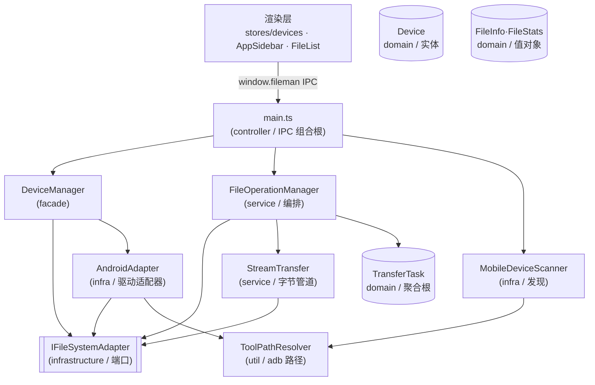
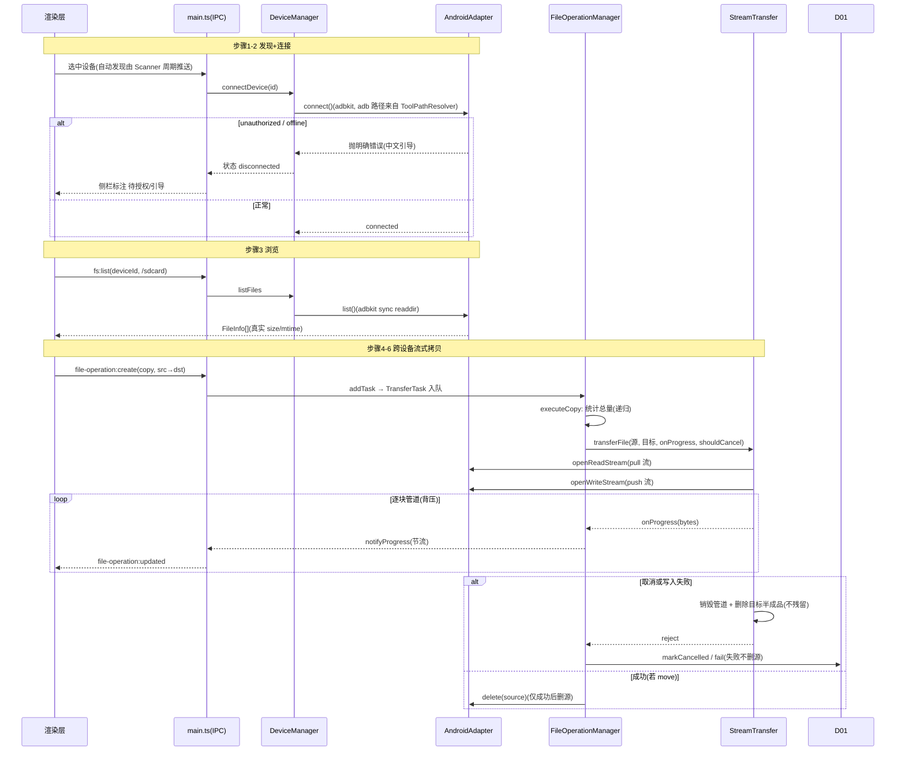

# Android(ADB)手机文件管理 — 阶段1 架构文档

> 真实栈:Electron 29(主 `main.ts` / 预加载 `preload.ts` / 渲染 `src`)+ TypeScript + Vue 3 + Pinia,electron-vite 打包。
> skill 内置 stack 枚举无 Electron,frontmatter 的 `stack: FastAPI+Vue` 仅为通过校验的枚举代理,真实栈以上述为准。
> 范围:阶段1 = Android(`/sdcard` 完整 CRUD + 跨设备流式传输 + adb 打包 + 未授权引导);iOS 是阶段2,本文不覆盖。

## 一、模块结构图

箭头方向 = 依赖(指向被依赖方)。可见依赖单向、指向稳定端口(`IFileSystemAdapter`)与工具解析(`ToolPathResolver`),无环、无下层反向依赖上层。

## 二、业务流程图

主流程 = 浏览(步骤1-3)+ 跨设备流式拷贝(步骤4-6),覆盖关键异常分支(未授权 / 取消 / 写入失败)。

## 三、角色职责清单

| 角色 | 类型 | 层 | 领域角色 | 职责 | 依赖 | 业界做法依据 | 设计原则 |
|---|---|---|---|---|---|---|---|
| IFileSystemAdapter | 分层 | infrastructure | — | 异构文件系统统一抽象端口(基本操作+可选流式+canStream) | — | 六边形 Port(Ports & Adapters)/Gateway | DIP、OCP、ISP |
| AndroidAdapter | 分层 | infrastructure | — | Android→adbkit 翻译(sync readdir/stat/pull/push + shell+exit marker),真实元数据+流式读写 | IFileSystemAdapter、ToolPathResolver | 六边形 Driven Adapter / Adapter 模式 | SRP、DIP、关注点分离 |
| ToolPathResolver | 分层 | util | — | 全仓唯一 adb 路径事实源(打包内/开发态) | — | Infrastructure/配置解析工具 | SRP、高内聚低耦合、关注点分离 |
| MobileDeviceScanner | 分层 | infrastructure | — | 经打包 adb 周期发现设备与授权状态 | ToolPathResolver | 轮询式发现服务 | SRP、关注点分离 |
| FileOperationManager | 分层 | service | — | 传输队列/任务编排:策略选择、目录递归、取消、进度 | IFileSystemAdapter、StreamTransfer、TransferTask | Application Service/任务队列+命令处理器 | SRP、DIP、OCP |
| StreamTransfer | 分层 | service | — | 两适配器间流式搬运单文件(管道+计量+背压+清理) | IFileSystemAdapter | Strategy 模式/流管道助手 | SRP、OCP、关注点分离 |
| DeviceManager | 分层 | facade | — | 设备生命周期门面:持适配器、按 type 创建、代理 FS | IFileSystemAdapter、AndroidAdapter | Facade(PoEAA) | DIP、高内聚低耦合 |
| main.ts(IPC 组合根) | 分层 | controller | — | 装配单例、注册 ipcMain 通道、推 file-operation:updated | Scanner、FOM、DeviceManager | Composition Root/Driving Adapter | DIP、关注点分离 |
| preload.ts + env.d.ts | 分层 | facade | — | contextBridge 暴露受控 API(防腐层)+ IPC 类型契约(含 canStream) | — | 防腐层(ACL)/API 网关 | ISP、关注点分离 |
| TransferTask | 领域 | domain | 聚合根 | 任务一致性边界:状态机(pending→running→completed/failed/cancelled)+进度 | — | DDD 聚合根 | aggregate、tell_dont_ask、SRP |
| Device | 领域 | domain | 实体 | 设备身份+生命周期状态+Android 授权态 | — | DDD 实体 | entity |
| FileInfo / FileStats | 领域 | domain | 值对象 | 不可变文件描述符(名/路径/类型/大小/修改时间) | — | DDD 值对象 | value_object |

> **领域角色二分**:本特性是"异构文件系统操作 + 传输编排"的技术性 feature,领域层较薄。有意义的领域对象为传输任务聚合根(TransferTask)、设备实体(Device)、文件值对象(FileInfo/FileStats)。**不设 domain_service**(编排属 FileOperationManager 应用服务,非纯领域逻辑);**不设 domain_event**(`file-operation:updated` 等是 IPC 集成事件,由 main 直接推送,非 DDD 领域事件)——二者均给出理由,不静默遗漏。

## 四、设计依据(为什么这么划 / 依据什么原则)

### IFileSystemAdapter
- 划分理由:把"文件系统怎么访问"抽象为端口,上层不绑定具体后端。
- 依据原则:DIP(上层依赖端口非具体实现);OCP(加可选流式方法不破坏既有实现);ISP(openReadStream/openWriteStream 可选 + canStream 门控,SMB/iOS 不实现也不受影响,缓冲回退)。

### AndroidAdapter
- 划分理由:Android 协议细节只此一处知晓;列表/属性走 adbkit sync 协议(readdir/stat)而非解析 `ls -la` 文本,根除跨厂商/版本解析脆弱;真实 size/mtime 取代旧的桩数据。
- 依据原则:SRP(只做 Android FS 翻译);DIP(实现端口);关注点分离(协议翻译与业务编排分离)。

### ToolPathResolver
- 划分理由:"adb 在哪里"(打包内 vs `$PATH`)与"adb 怎么用"分离,Scanner/Adapter 不各自猜路径。
- 依据原则:SRP;DRY(全仓唯一 adb 路径源);关注点分离。

### MobileDeviceScanner
- 划分理由:设备发现是独立关注点(周期轮询、状态 diff),不应混入文件操作或 UI。
- 依据原则:SRP(只发现);关注点分离。

### FileOperationManager
- 划分理由:传输是"队列+任务+策略选择+进度+取消"的编排关注点;字节搬运与任务状态机分别下沉,保持本角色单一。
- 依据原则:SRP(只编排);DIP(依赖端口与 StreamTransfer/TransferTask);OCP(按 canStream 选策略不改适配器)。

### StreamTransfer
- 划分理由:流式管道(管道+计量+背压+取消+半成品清理)是独立且可复用的机制,从队列编排中抽出,便于正确性与可测性。
- 依据原则:SRP(只管字节管道);OCP(流式/缓冲策略按 capability 切换);关注点分离。

### DeviceManager
- 划分理由:多设备类型(Local/SMB/SSH/Android/iOS)的创建、生命周期与 FS 代理需要一个统一入口,避免上层各自 new 适配器;它只编排不持有业务规则。
- 依据原则:DIP(按 type 创建并持有,上层依赖门面);高内聚低耦合(设备相关逻辑内聚于一处)。

### main.ts(IPC 组合根)
- 划分理由:依赖装配与 IPC 协议入口须单独成层,不含业务逻辑;所有 ipcMain.handle 集中注册便于契约同步。
- 依据原则:DIP(组装依赖、注入窗口);关注点分离(装配与逻辑分离)。

### preload.ts + env.d.ts
- 划分理由:渲染进程不得直连主进程,经 contextBridge 暴露受控 API(防腐层);IPC 类型契约三处同步,防止契约漂移。
- 依据原则:ISP(只暴露渲染层所需方法);关注点分离(协议边界隔离)。

### TransferTask
- 划分理由:任务有强一致的状态机与进度不变量,应收进聚合根;外部调其行为方法而非直改字段(纠正原贫血数据类)。
- 依据原则:aggregate(一致性边界);tell_dont_ask(行为归对象);SRP。

### Device
- 划分理由:每台设备有唯一身份(deviceId)与生命周期(connected/connecting/disconnected)+ Android 授权态,是跨流程被引用的实体,非纯值。
- 依据原则:entity(有身份+生命周期)。

### FileInfo / FileStats
- 划分理由:文件描述是按值判等、不可变的描述型数据,用值对象表达避免基本类型满地。
- 依据原则:value_object(无身份、按值判等)。

## 五、关键接口契约(P1)

- **IFileSystemAdapter**(端口,`types.ts`):`list/stat/mkdir/delete/rename/readFile/writeFile/copy/search/exists` + 可选 `openReadStream/openWriteStream`;能力位 `canStream`(`capabilities.ts`)。
- **StreamTransfer.transferFile(source, srcPath, target, dstPath, { onProgress, shouldCancel })**:`Promise<number>`(字节数);不变量:取消/失败删目标半成品、失败绝不删源;按双方 `canStream` 选流式或缓冲。
- **TransferTask**(聚合根):`markRunning/complete/fail/markCancelled/setTotals/addBytes/setCurrentFile/recordItem`;状态机 pending→running→{completed|failed|cancelled}。
- **AndroidAdapter 流式**:`openReadStream = adbkit pull(PullTransfer,Readable)`;`openWriteStream` 暴露 Writable,其 `final()` 等 PushTransfer `'end'` 后才完成 —— 保证 pipeline 完成 ⟺ 设备写入完成(避免 move 在写入完成前误删源)。
- **IPC 契约三处同步**:`main.ts`(handle)/ `preload.ts`(filemanAPI+类型)/ `env.d.ts`(Window['fileman']);本次新增 `canStream` 字段在三处的 `DeviceCapabilities` 均已补齐。

## 六、已知缺口 / 未决

- ⚠ **stack 枚举不含 Electron**:`design-contract.stack` 以 `FastAPI+Vue` 作枚举代理,真实栈见 frontmatter 与 `existing_alignment`(工具能力限制,非设计问题)。
- ⚠ **主进程无静态门禁**:`npm run typecheck`(vue-tsc)仅覆盖 renderer `src/**`,`electron/**` 从未被其覆盖。仓库存在 4 个 **pre-existing** 主进程类型错误(`main.ts` 的 `Credentials` 未再导出 / `LocalAdapter.search` 内嵌 `this` / `SMBAdapter` 的 `@aozp/smb2` 未装 / `SSHAdapter` 的 `ssh2` 缺声明),均非本特性引入;本特性新增/改动文件在 `tsc -p tsconfig.node.json` 下零错误。后续把 electron 纳入 CI 的 tsc 检查并清理这 4 项为独立工程任务。
- ⚠ **覆盖策略**:目标同名现状为"跳过",需求 R7 要求"询问覆盖/跳过/重命名";作为后续增强(FileOperationManager 增覆盖策略参数 + 渲染层询问 IPC)。
- ⚠ **SMB/iOS 流式未实现**:这两端 `canStream=false`,大文件走整文件缓冲回退;评估 `@aozp/smb2` 流式能力后再补。
- ⚠ **打包 adb 二进制**:`npm run dist:mac` 前须自行放入 macOS `adb` 到 `build/tools/adb`(见该目录 README);可能需处理 macOS quarantine(`xattr`)。
- ⚠ **真机回归未做**:无测试套件,本次仅通过 `tsc -p tsconfig.node.json`(主进程零错)+ `npm run typecheck`(渲染层仅原 3 个 pre-existing)+ `npm run build`(打包通过)验证;真机 USB/授权/大文件传输的运行期回归尚未执行。
