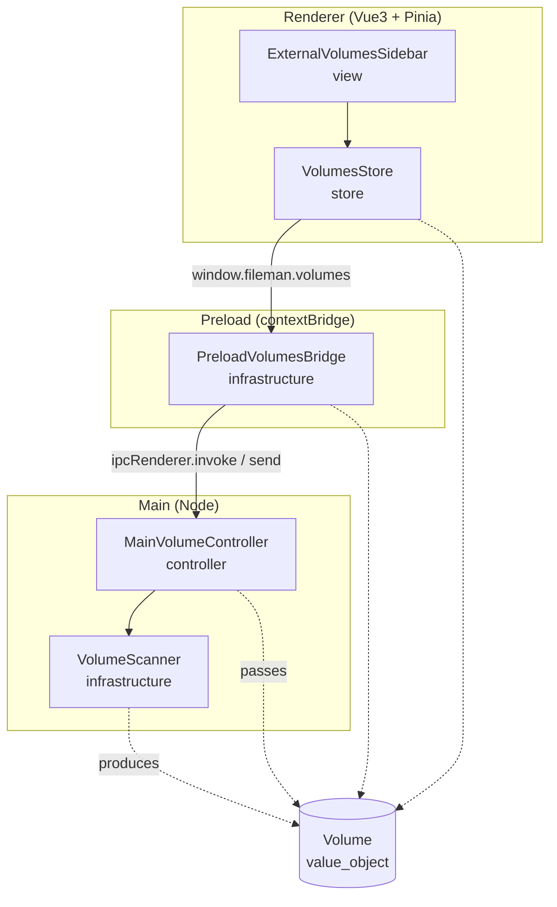
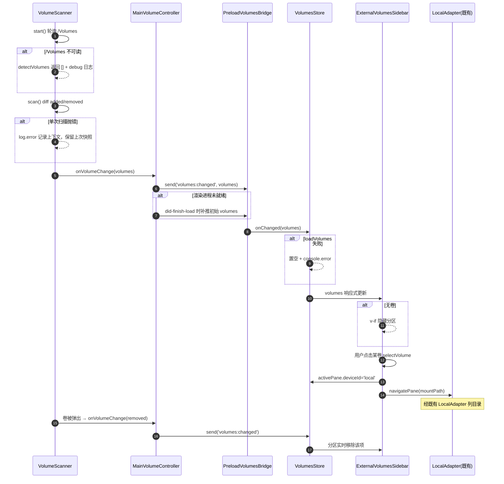

# 外接磁盘侧栏列出与浏览 架构文档

> 需求：在 macOS 上检测已挂载的外接磁盘（`/Volumes/*`），在 `AppSidebar.vue` 新增分区列出；点击后切到 `local` 设备并导航到挂载路径，复用既有 `LocalAdapter` 浏览。
>
> 栈映射：Electron 三段式映射到 `FastAPI+Vue` 模型 —— main(Node 服务 + ipcMain 控制器) ≈ 后端；preload(contextBridge) ≈ 端口适配器/API Client；renderer(Vue3+Pinia) = 前端。

## 一、模块结构图

依赖方向单向：渲染层（view→store→preload bridge）→ main（controller→scanner）；领域值对象 `Volume` 被各层引用但不反向依赖上层。scanner 内部 `detectVolumes` 是检测策略的可替换点。

## 二、业务流程图

覆盖主流程 + 关键异常分支（不可读 / 未就绪 / 远程 pane / 弹出）。

## 三、角色职责清单

| 角色 | 类型 | 层 | 领域角色 | 职责 | 依赖 | 业界做法依据 | 设计原则 |
|---|---|---|---|---|---|---|---|
| Volume | 领域 | domain | 值对象 | 不可变 {id,name,mountPath,isRemovable}，以 mountPath 标识 | — | DDD 值对象 | value_object、high_cohesion_low_coupling |
| VolumeScanner | 分层 | infrastructure | — | 平台级检测挂载卷、轮询 diff emit；唯一封装『如何读卷』 | Volume | 平台探针/端口适配器（MobileDeviceScanner、drivelist 同类） | SRP、OCP、separation_of_concerns |
| MainVolumeController | 分层 | controller | — | volumes:list handler + volumes:changed 推送 + 初推 + 启动扫描 | VolumeScanner、Volume | IPC Controller/应用端点（device:/mobile: 同构） | SRP、separation_of_concerns、DIP |
| PreloadVolumesBridge | 分层 | infrastructure | — | contextBridge 暴露 window.fileman.volumes.{list,onChanged} | MainVolumeController、Volume | contextBridge 契约（渲染层 API Client） | separation_of_concerns、DIP |
| VolumesStore | 分层 | store | — | 持有卷列表、拉初始、订阅变化更新；不掺 UI/不知检测 | PreloadVolumesBridge、Volume | Pinia store（一关注点一 store） | SRP、separation_of_concerns |
| ExternalVolumesSidebar | 分层 | view | — | 渲染 External Volumes 分区；点击切 local + 导航；无卷隐藏 | VolumesStore | Vue 业务组件（Tell-Don't-Ask 前端版） | SRP、separation_of_concerns、tell_dont_ask |

## 四、设计依据

### Volume（值对象）
- 划分理由：外接卷是一个无生命周期的描述性概念（挂载点 + 名字），用值对象建模而非实体/聚合；以 `mountPath` 唯一标识，跨 main/renderer 两端声明（沿用仓库类型跨 IPC 边界复制的现状）。
- 依据原则：`value_object`（不可变、以标识区分）；`high_cohesion_low_coupling`（卷相关字段内聚）。
- 业界来源：DDD 值对象。

### VolumeScanner（infrastructure）
- 划分理由：『如何从平台读到已挂载卷』是与 OS 强相关的底层细节，必须单独隔离，不能漏到 controller/store/view。检测策略（枚举 `/Volumes`）封在私有 `detectVolumes`，日后替换为 `drivelist` 不波及调用方。
- 依据原则：`SRP`（只做平台卷检测）；`OCP`（检测策略可扩展不修改调用方）；`separation_of_concerns`（平台细节隔离）。
- 业界来源：仓库现有 `MobileDeviceScanner`（轮询+Map diff+emit）、社区 `drivelist`。

### MainVolumeController（controller）
- 划分理由：IPC 通道是协议适配点，应只做『收请求/转发/推送』，不含检测逻辑。与 `device:`/`mobile:` handlers 同构，保证 main 的接入层一致。
- 依据原则：`SRP`（只做 IPC 编排）；`separation_of_concerns`（协议与检测分离）；`DIP`（依赖 VolumeScanner 抽象行为而非平台细节）。
- 业界来源：IPC Controller / 应用端点。

### PreloadVolumesBridge（infrastructure）
- 划分理由：渲染进程受 contextIsolation 隔离，必须经 contextBridge 暴露一个稳定端口；渲染层只依赖 `window.fileman.volumes` 抽象，不感知 ipcMain 通道名与 Node。
- 依据原则：`separation_of_concerns`（隔离 Node）；`DIP`（渲染层依赖端口抽象）。
- 业界来源：contextBridge 契约 / 端口适配器。

### VolumesStore（store）
- 划分理由：卷列表是跨组件共享的响应式状态，且与『如何检测』『如何渲染』是两件事；单独成 store 与 devices/tabs/transfers 等并列，职责单一。
- 依据原则：`SRP`（只管状态与订阅）；`separation_of_concerns`（不掺 UI、不知检测）。
- 业界来源：Pinia store 惯例。

### ExternalVolumesSidebar（view）
- 划分理由：渲染与点击协调是纯展示层职责；点击只做『把行为交给 store/tabsStore』（置 local + navigatePane），不自己持有卷数据或检测逻辑。
- 依据原则：`SRP`（只渲染+发导航）；`separation_of_concerns`；`tell_dont_ask`（把导航交给 tabsStore，不反向查询）。
- 业界来源：Vue 业务组件（props/events 单向数据流）。

## 五、关键接口契约（P1）

- `VolumeScanner`（main）：`start(): void`、`stop(): void`、`scan(): Promise<Volume[]>`、`onVolumeChange(handler): () => void`、`getVolumes(): Volume[]`。
- IPC 通道：`volumes:list` → `Volume[]`（快照）；`volumes:changed` ← main 推送 `Volume[]`（挂载/弹出）。
- `window.fileman.volumes`（renderer）：`list(): Promise<Volume[]>`、`onChanged(cb): () => void`。
- `useVolumesStore`（renderer）：`volumes: Volume[]`、`loadVolumes(): Promise<void>`、`setupVolumesListener(): void`。
- `selectVolume(volume)` 契约：必须 `activePane.deviceId = 'local'` 在前、`navigatePane(pane.id, volume.mountPath)` 在后。

## 六、已知缺口 / 未决

- ⚠ **`/Volumes` 下网络挂载（SMB/NFS）与 DMG 也会被一并列出** —— 影响：侧栏可能多列非物理外接盘项；当前语义为『已挂载卷』，可接受。后续：替换 `detectVolumes` 为 `drivelist`，依 `isRemovable/isSystem` 精确过滤（OCP 已封口）。
- ⚠ **检测策略仅覆盖 macOS（`/Volumes`）** —— 影响：Windows（盘符）/Linux（`/media`、`/mnt`）下无外接卷列出。后续：在 `detectVolumes` 内按 `process.platform` 分支扩展，值对象与上层无需改动。
- ⚠ **`isRemovable` 在『枚举 /Volumes』策略下为尽力而为（恒 true）** —— 影响：该字段当前无实际区分作用。后续：引入 drivelist 后精确化；字段已预留且调用方未依赖其真假。

> 辅助校验未覆盖的语义项（职责是否真单一、依赖是否真合理、卷是否真该如此建模）由 LLM 语义自检认定并在此登记；脚本仅提供角色↔文件存在、流程↔代码↔文档两类结构性证据。
>
> ⚠ **日志门脚本误伤（栈错配）**：`validate_gate.py` 的日志正则面向 Python/C++ 的 `logger`/`log` 对象，无法识别本仓库运行期使用的 JS `console.log/error`。脚本据此判日志门 no-go，但实际 5/5 运行期代码单元（VolumeScanner 用 `log` 助手；main.ts / preload.ts / volumes.ts / AppSidebar.vue 用 `console.*`）均在 入口/异常/外部调用 关键节点打点；`env.d.ts` 为纯类型声明文件无运行期代码。故人工认定日志门 go，详见契约 `gate.notes`。
