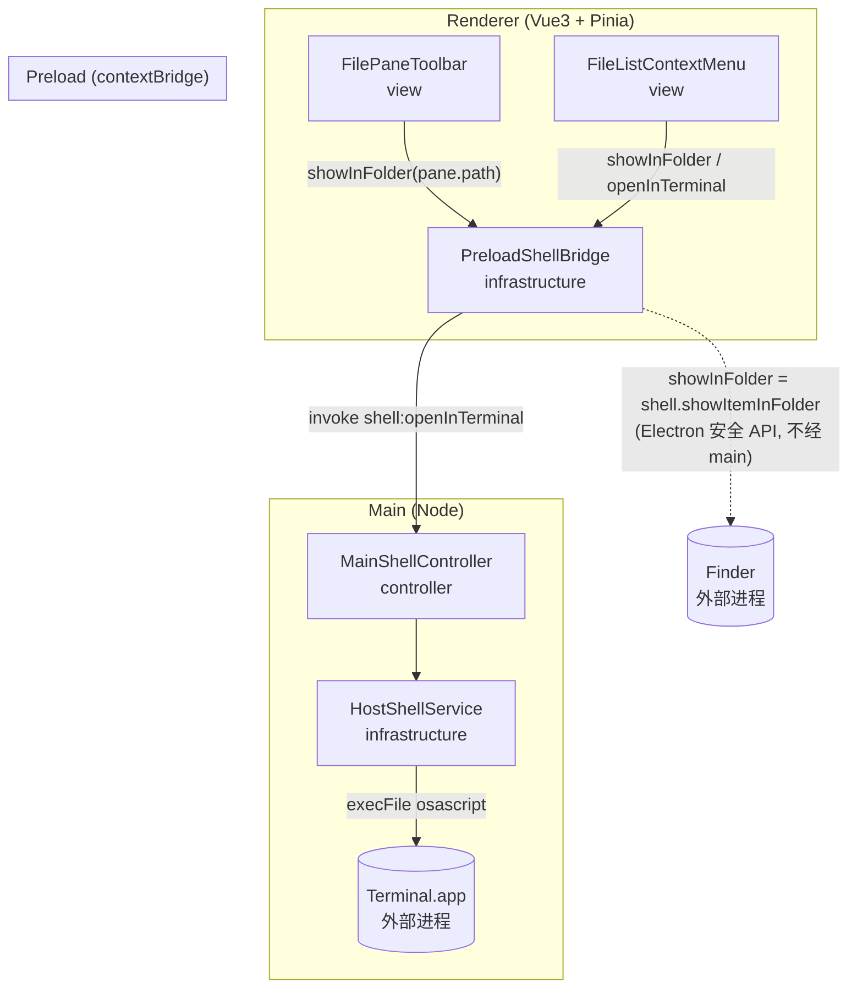
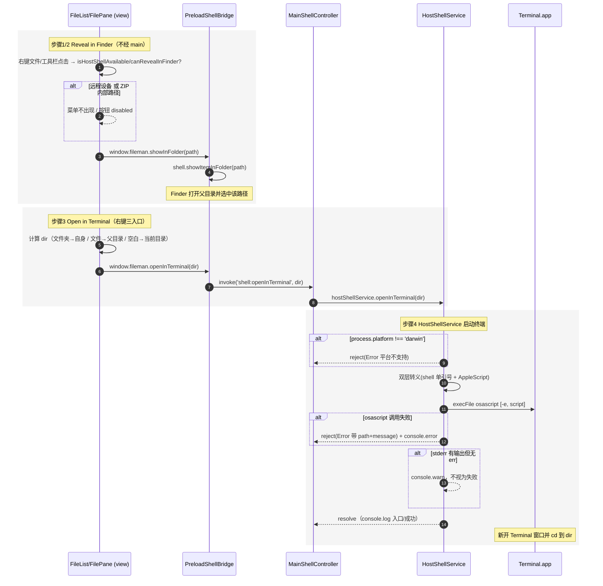

# 文件浏览面板的 Finder/Terminal 宿主集成 架构文档

> 需求：在文件浏览面板为文件/文件夹右键菜单新增「Reveal in Finder」「Open in Terminal」；空白区右键新增「Open in Terminal」（打开当前目录）；工具栏新增按钮「Reveal in Finder」（定位当前目录）。全部仅对本地设备 `local` 且不在 ZIP 虚拟路径内生效。
>
> 栈映射：Electron 三段式映射到 `FastAPI+Vue` 模型 —— main(Node 服务 + ipcMain 控制器) ≈ 后端；preload(contextBridge) ≈ 端口适配器/API Client；renderer(Vue3+Pinia) = 前端。与既有 `external-volumes` 架构同构。

## 一、模块结构图

依赖方向单向：渲染层（view → preload bridge）→ main（controller → HostShellService）；HostShellService 是叶子（平台执行细节），不反向依赖上层。Reveal in Finder 复用既有 preload `showInFolder`（`shell.showItemInFolder`），不经 main；Open in Terminal 经 main service（需 spawn）——两者机制不同，故路径分离（见 DC-4）。

## 二、业务流程图

覆盖主流程 + 关键异常分支（远程/ZIP 门控、平台不支持、osascript 失败、目标目录取值）。

## 三、角色职责清单

| 角色 | 类型 | 层 | 职责 | 依赖 | 业界做法依据 | 设计原则 |
|---|---|---|---|---|---|---|
| HostShellService | 分层 | infrastructure | 封装『在本平台用终端打开本地目录』的执行（macOS=osascript + 双层转义），唯一持有平台命令细节 | — | 平台探针/端口适配器（同 VolumeScanner/MobileDeviceScanner：child_process 封装 OS 细节） | SRP、OCP、separation_of_concerns |
| MainShellController | 分层 | controller | 注册 `shell:openInTerminal` handler，薄端点转发 HostShellService，不含平台命令 | HostShellService | IPC Controller/应用端点（同 device:/mobile: handlers） | SRP、separation_of_concerns、DIP |
| PreloadShellBridge | 分层 | infrastructure | 经 contextBridge 暴露 `window.fileman.openInTerminal`，并持有既有 `showInFolder`；隔离渲染与 Node | MainShellController | contextBridge 契约（渲染层 API Client） | separation_of_concerns、DIP |
| FileListContextMenu | 分层 | view | 文件/文件夹菜单加 Reveal in Finder + Open in Terminal，空白菜单加 Open in Terminal；local+非ZIP 门控；即时调用不经队列 | PreloadShellBridge | Vue 业务组件（在既有菜单系统扩展；即时宿主调用同 refresh/rename） | SRP、separation_of_concerns |
| FilePaneToolbar | 分层 | view | 工具栏加 Reveal in Finder 按钮 → 定位当前目录；local+非ZIP 门控启用/禁用 | PreloadShellBridge | Vue 工具栏组件（复用 toolbar-btn-enhanced；Tell-Don't-Ask） | SRP、separation_of_concerns、tell_dont_ask |

> **角色二分显式**：本需求只用分层角色，无领域角色(DDD)。理由：操作对象是路径字符串，无不变量/身份/生命周期需建模；强造值对象违反 YAGNI。故 `domain_roles=0`。

## 四、设计依据

### HostShellService（infrastructure）
- 划分理由：『如何在本平台用终端打开目录并 cd 进去』是与 OS 强相关的执行细节（osascript 命令 + shell/AppleScript 双层转义），必须单独隔离，不能漏到 controller 或渲染层。平台策略封在 `openInTerminal` 内，日后支持 Windows/Linux 只改此方法。
- 依据原则：`SRP`（只做平台终端启动）；`OCP`（平台策略可扩展不修改调用方）；`separation_of_concerns`（OS 细节隔离）。
- 业界来源：仓库现有 `VolumeScanner`/`MobileDeviceScanner`（child_process 封装 OS 交互为独立 service）、社区终端启动惯例。

### MainShellController（controller）
- 划分理由：IPC 通道是协议适配点，应只做『收请求/转发』，不含 osascript 命令。与 `device:`/`mobile:` handlers 同构，保证 main 接入层一致。
- 依据原则：`SRP`（只做 IPC 编排）；`separation_of_concerns`（协议与执行分离）；`DIP`（依赖 HostShellService 抽象行为而非平台细节）。
- 业界来源：IPC Controller / 应用端点。

### PreloadShellBridge（infrastructure）
- 划分理由：渲染进程受 contextIsolation 隔离，必须经 contextBridge 暴露稳定端口；渲染层只依赖 `window.fileman.openInTerminal` / `showInFolder` 抽象，不感知 ipcMain 通道名与 Node。`showInFolder` 复用 Electron 安全 API `shell.showItemInFolder`（已在用），无需经 main。
- 依据原则：`separation_of_concerns`（隔离 Node）；`DIP`（渲染层依赖端口抽象）。
- 业界来源：contextBridge 契约 / 端口适配器。

### FileListContextMenu（view）
- 划分理由：右键菜单条目的构建与即时路由是纯展示层职责；宿主动作是即时调用（非文件操作任务），不经 FileOperationManager 队列，在 `handleContextMenuAction` 内联处理，与既有 `refresh`/`rename` 同模式。门控（local+非ZIP）封在 `isHostShellAvailable`，菜单根本不出现该项。
- 依据原则：`SRP`（只构建菜单 + 路由即时动作）；`separation_of_concerns`（不掺文件操作队列）。
- 业界来源：Vue 业务组件（在既有 `buildContextMenuItems`/`handleContextMenuAction` 扩展）。

### FilePaneToolbar（view）
- 划分理由：工具栏按钮渲染与点击协调是纯展示层职责；点击只发起 `showInFolder(pane.path)`，不自己持有路径逻辑。门控 `canRevealInFinder` 复用既有 `isInsideZip` 计算。
- 依据原则：`SRP`（只渲染按钮 + 发起调用）；`separation_of_concerns`；`tell_dont_ask`（直接发起，不反向查询）。
- 业界来源：Vue 工具栏组件（复用 `toolbar-btn-enhanced` 样式）。

## 五、关键接口契约（P1）

- `HostShellService`（main）：`openInTerminal(dirPath: string): Promise<void>`；macOS 经 `execFile('osascript', ['-e', script])`；非 darwin reject；失败 reject 带 path+message。
- IPC 通道：`shell:openInTerminal` → `(dirPath: string) => Promise<void>`（main handler 转发 HostShellService）。
- `window.fileman`（renderer）：`openInTerminal: (path: string) => Promise<void>`（新增）；`showInFolder: (path: string) => void`（既有，`shell.showItemInFolder`）。
- 门控契约（renderer）：
  - `FileList.isHostShellAvailable()` = `props.deviceId === 'local' && !isZipVirtualPath(props.path)` —— 文件/文件夹/空白菜单项是否追加。
  - `FilePane.canRevealInFinder` = `pane.deviceId === 'local' && !isInsideZip` —— 工具栏按钮 enabled/disabled。
- 目标目录取值契约（Open in Terminal）：文件夹 → 自身 `file.path`；文件 → `parentDirectory(file.path)`；空白右键 → 当前目录 `props.path` / `pane.path`。

## 六、已知缺口 / 未决

- ⚠ **Open in Terminal 仅实现 macOS（osascript）** —— 影响：Windows/Linux 下点击会 reject 报平台不支持；本仓库 macOS-focused，影响有限。后续：在 `HostShellService.openInTerminal` 内按 `process.platform` 分支（Windows `start`、Linux 按 `$TERMINAL`），IPC/控制器/视图无需改动（OCP 已封口，DC-2）。
- ⚠ **Reveal in Finder 与 Open in Terminal 实现机制非对称**（前者 preload `shell.showItemInFolder`，后者 main spawn）—— 影响：两项宿主操作分居两层；可接受——机制本质不同（安全同步 API vs 需 spawn 进程），且复用在用的 `showInFolder` 避免改动 `preview.ts`/`TaskItem.vue` 两个调用方。后续：若追求单一归属，可将 `showInFolder` 迁入 main `HostShellService` 新增 `shell:revealInFinder` IPC 并同步改 2 个调用点（当前 YAGNI，未做）。
- ⚠ **工具栏仅 Reveal in Finder 按钮，未加 Open in Terminal 按钮** —— 影响：一键只能定位到 Finder，终端入口仅经右键菜单。后续：需求原文工具栏只提 Finder；如需终端按钮，可在 `FilePaneToolbar` 复用 `canRevealInFinder` 门控新增第二个按钮调用 `openInTerminal(pane.path)`。

> 辅助校验未覆盖的语义项（职责是否真单一、依赖是否真合理、无领域角色是否合理）由 LLM 语义自检认定并在此登记；脚本仅提供角色↔文件存在、流程↔代码↔文档两类结构性证据。
>
> ⚠ **日志门脚本误伤（栈错配）**：`validate_gate.py` 的 FastAPI+Vue 日志正则 `\b(?:logger|log|logging)\s*(?:\.|::)` 要求 `log/logger` 后跟点号或 `::`，而本 Electron 仓库运行期统一用 JS `console.log/error/warn`（点号在 `console` 与 `log` 之间，即点号在 `log` **之前**而非之后），该正则无法识别 `console.*` —— 故全部运行期单元被计为零日志，脚本据此判日志门 no-go。实际 4/4 运行期单元均在关键节点打点：`HostShellService`(入口 `console.log`/异常 `console.error`/外部调用 osascript 前后 + stderr `console.warn`)、`main.ts`(controller 转发，复用既有 `[Main]`/`[zip]` 日志惯例)、`preload.ts`(bridge，复用既有 `[Preload]` 惯例)、`FileList.vue`(异常 `console.error` 捕获 `openInTerminal` 失败)、`FilePane.vue`(复用既有 `[FilePane]` 惯例)；`env.d.ts` 为纯类型声明文件(.d.ts)无运行期代码。故人工认定日志门 go，详见契约 `gate.notes`。
