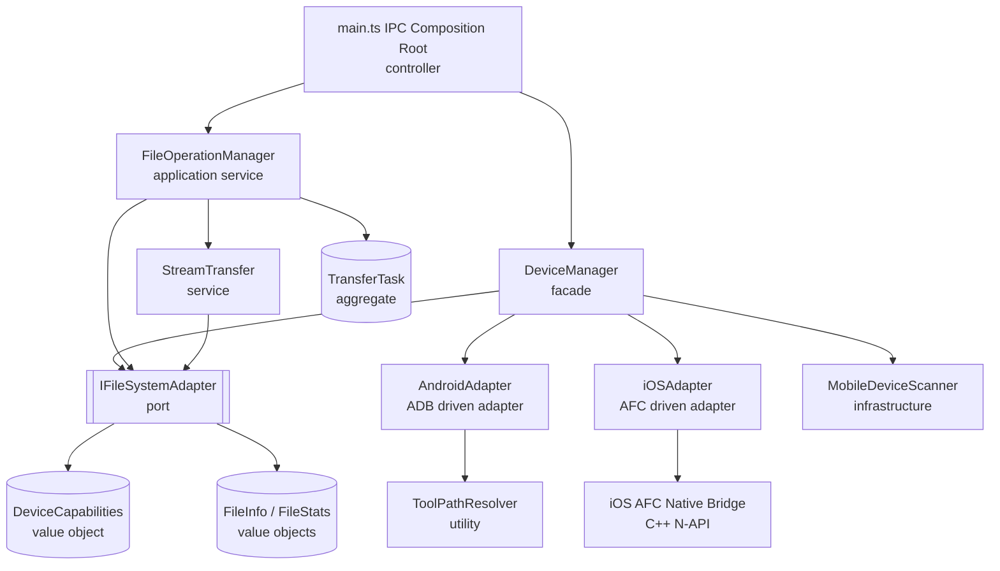
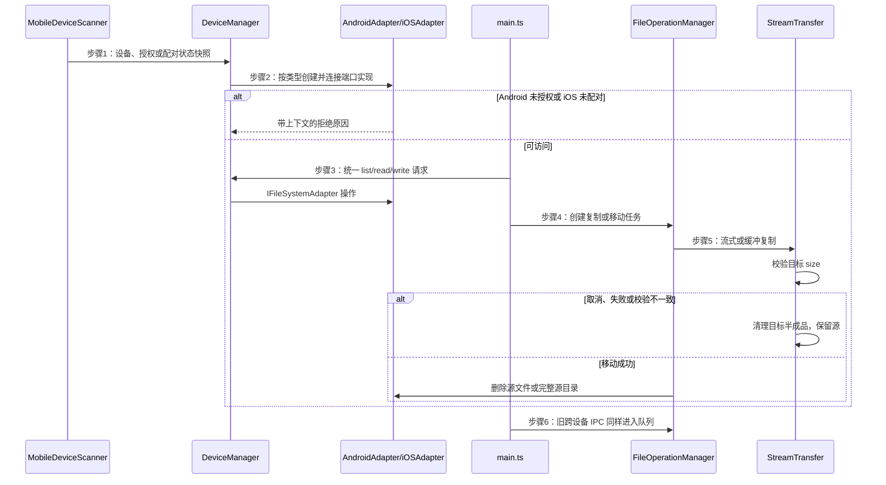

# 多设备抽象文件系统 — Android 与 iOS 适配

> 真实栈是 Electron 29 + TypeScript + Vue 3 + iOS AFC C++ N-API addon。`FastAPI+Vue` 仅用于满足本技能的固定枚举，代码与设计判断以真实栈为准。

## 一、模块结构图

箭头指向被依赖方。协议差异只停留在驱动适配器和原生 bridge，传输服务只认识统一端口。

## 二、业务流程图

## 三、角色职责清单

| 角色 | 类型 | 层 | 领域角色 | 职责 | 依赖 | 业界做法依据 | 设计原则 |
|---|---|---|---|---|---|---|---|
| IFileSystemAdapter | 分层 | infrastructure | — | 定义统一文件系统端口和可选流式扩展 | DeviceCapabilities、FileInfo / FileStats | Ports and Adapters Port / Gateway | DIP、OCP、ISP |
| DeviceCapabilities | 领域 | domain | 值对象 | 描述端口能力边界 | — | DDD 值对象 | value_object、ISP |
| TransferTask | 领域 | domain | 聚合根 | 封装传输状态、进度和结果 | — | DDD 聚合根 | aggregate、Tell-Don't-Ask、SRP |
| FileInfo / FileStats | 领域 | domain | 值对象 | 描述跨设备文件元数据 | — | DDD 值对象 | value_object、关注点分离 |
| AndroidAdapter | 分层 | infrastructure | — | 映射 ADB sync、shell 和 pull/push | IFileSystemAdapter、ToolPathResolver | GoF Adapter / Hexagonal Driven Adapter | SRP、DIP、关注点分离 |
| iOSAdapter | 分层 | infrastructure | — | 映射 AFC 操作并校验配对与大小 | IFileSystemAdapter、iOS AFC Native Bridge | GoF Adapter / Anti-Corruption Layer | SRP、DIP、关注点分离 |
| ToolPathResolver | 分层 | util | — | 解析 adb 运行时路径 | — | Infrastructure configuration resolver | SRP、高内聚低耦合、关注点分离 |
| iOS AFC Native Bridge | 分层 | infrastructure | — | 管理原生 AFC 会话和资源释放 | FileInfo / FileStats | Native gateway / Foreign Function Adapter | SRP、ISP、关注点分离 |
| MobileDeviceScanner | 分层 | infrastructure | — | 扫描并报告设备及状态变化 | ToolPathResolver | Infrastructure polling monitor | SRP、关注点分离 |
| DeviceManager | 分层 | facade | — | 管理生命周期、创建适配器和代理端口 | IFileSystemAdapter、AndroidAdapter、iOSAdapter、MobileDeviceScanner | Facade / Application Service | DIP、SRP、高内聚低耦合 |
| StreamTransfer | 分层 | service | — | 搬运、计量、取消、清理和校验单文件 | IFileSystemAdapter | Strategy / Pipe-and-Filter | SRP、OCP、关注点分离 |
| FileOperationManager | 分层 | service | — | 编排队列、递归复制、移动安全与进度 | IFileSystemAdapter、StreamTransfer、TransferTask | DDD Application Service / command queue | SRP、DIP、OCP、Tell-Don't-Ask |
| main.ts IPC Composition Root | 分层 | controller | — | 装配服务并让所有跨设备 IPC 走队列 | DeviceManager、FileOperationManager | Composition Root / Driving Adapter | DIP、SRP、依赖方向 |

## 四、设计依据

### IFileSystemAdapter

把“如何访问文件系统”定义为端口，使本地、SSH、SMB、Android 和 iOS 的调用方都依赖抽象。可选流式方法由 `canStream` 能力门控，遵循 ISP；新增设备实现端口即可，遵循 OCP。

### DeviceCapabilities

能力不能散落在视图或传输服务中。用值对象集中表达读写、搜索、跨设备和流式边界，避免调用方猜测后端能力，遵循 value_object 与 ISP。

### TransferTask

传输状态、进度和单项结果必须共同转移，因此作为聚合根封装。`FileOperationManager` 告知任务改变状态，而不是外部随意改字段，遵循 aggregate、Tell-Don't-Ask 与 SRP。

### FileInfo / FileStats

文件元数据是端口间传输的描述值，不应混入设备连接或传输行为，遵循 value_object 与关注点分离。

### AndroidAdapter

Android 专有的 adbkit sync、shell exit marker 和 pull/push 流只存在于此适配器；业务编排不解析 Android 命令输出。这样满足 SRP、DIP 和关注点分离。

### iOSAdapter

iOS AFC 的配对和写入大小约束在适配器内执行。每次文件操作先验证配对；信任撤销后关闭旧 handle 并返回可操作的报错。AFC 是系统给定沙盒边界，因此不把 `/` 声明为静态只读，以免误禁真实可写容器。该划分遵循 SRP、DIP 和关注点分离。

### ToolPathResolver

打包态与开发态 adb 路径的选择属于运行时配置，不应重复在扫描器和 AndroidAdapter 中实现，遵循 SRP 与高内聚低耦合。

### iOS AFC Native Bridge

C++ bridge 独自保存 libimobiledevice 的 device、lockdown 和 AFC 资源，并只给 JavaScript 暴露整数 handle。它隔离 N-API、资源释放顺序和原生错误，遵循 SRP、ISP 与关注点分离。

### MobileDeviceScanner

扫描器只关注外部设备快照和变化；授权、拔线以及 iOS 配对状态变化均触发通知。它不执行文件操作，遵循 SRP 和关注点分离。

### DeviceManager

设备创建、连接生命周期和适配器查找集中在一个门面，上层不直接创建具体适配器，遵循 DIP、SRP 与高内聚低耦合。

### StreamTransfer

字节管道、进度、取消、半成品清理和写入后 size 校验是独立机制。它依端口选择流式或缓冲策略，遵循 SRP、OCP 与关注点分离。

### FileOperationManager

队列、目录递归与任务结果编排不应混入协议代码。移动仅在目标 size 校验成功后删除源；冲突跳过或任一目录子项未完成都会保留源，遵循 SRP、DIP、OCP 与 Tell-Don't-Ask。

### main.ts IPC Composition Root

IPC 是驱动适配器与组合根，只负责装配和转发。旧 `fs:copyBetween`、`fs:moveBetween` 现在也委托队列，防止出现第二套不安全传输路径，遵循 DIP、SRP 与依赖方向。

## 五、关键接口契约（P1）

- `IFileSystemAdapter`：提供 `list`、`stat`、`readFile`、`writeFile`、`mkdir`、`delete`、`rename`、`copy`、`search` 和 `exists`；`openReadStream`/`openWriteStream` 仅在 `canStream` 为真时调用。
- `DeviceCapabilities`：`canCopyFrom/canCopyTo` 和 `canMoveFrom/canMoveTo` 决定跨设备方向；iOS 当前 `canStream=false` 且单文件上限为 2 GiB。
- `StreamTransfer.transferFile`：传输成功前校验目标的文件类型和大小；取消、失败或校验失败时尽力删除目标半成品，绝不删除源。
- `FileOperationManager.copyFile/copyTree`：同名目标返回 skipped 并保留源；目录移动要求整个子树复制完成；旧 IPC 使用 `addTaskAndWait` 进入相同生命周期。
- `iOSAdapter.h`：每个 AFC 操作前重新调用 `isPaired`；配对失效后断开 handle 并拒绝操作。

## 六、已知缺口 / 未决

- AFC 端当前没有流式接口；涉及 iOS 的大文件走缓冲回退，影响是内存占用较高；下一阶段在原生 bridge 增加分块流接口。
- 同名冲突策略当前为 skip；影响是移动会保留源而不会提供覆盖或重命名选择；下一阶段在任务参数和 renderer 增加显式冲突决策。
- 未在本工作区连接真机；影响是 ADB 授权、AFC 目录权限和撤销信任需要实测；下一阶段完成 USB 浏览、复制、取消、拔线和撤销信任的回归记录。

辅助校验未覆盖职责是否真正单一、依赖是否没有隐式跨层等语义项；这些已基于本次角色边界和代码调用路径进行人工复核。日志脚本无法识别项目既定的 `console + [组件名]` 模式，相关说明在设计契约的 `gate.notes` 中保留。
