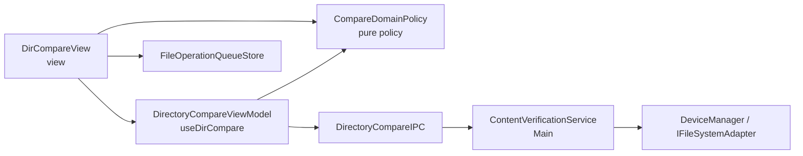
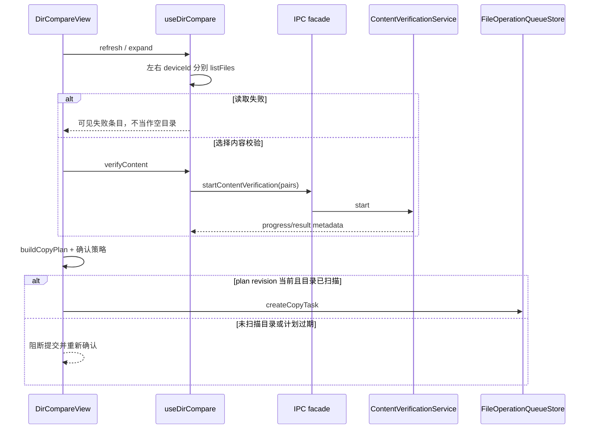

# 内置文件夹对比与内容校验 — 架构文档

## 零、用户确认记录

- 等级选择：用户在消息中选择 `standard`。
- 方案版本：`1`。
- 方案确认：用户在完整方案展示后的后续消息中确认 `ALT-1` 按方案编码，随后再次确认“确认按1编码”。

## 一、模块结构图

依赖只从 View 到 ViewModel/策略/队列，再由 IPC facade 到 Main service；文件字节停留在 Main 与 adapter 边界，renderer 只接收任务和状态元数据。

## 二、业务流程图

### 业务流程图-步骤1：跨设备读取与显示目录

`useDirCompare.refresh` 和懒加载读取明确区分 leftDeviceId/rightDeviceId；失败保留为带设备和路径的错误条目。

### 业务流程图-步骤2：启动并接收内容校验

`verifyContent` 发送文件对元数据；Main service 对每对顺序计算 SHA-256，并在取消、未连接或无流超限时返回单对状态。

### 业务流程图-步骤3：生成复制预检并请求确认

`buildCopyPlan` 只处理当前选择；未展开目录被写入 blockedItems，确认框展示该原因。

### 业务流程图-步骤4：提交确认后的复制队列

计划 revision 必须仍等于当前 dataRevision；通过后由既有 `createCopyTask` 排队，View 不直接写文件。

## 三、角色职责清单

| 角色 | 类型 | 层 | 职责 | 隐藏秘密 | 数据所有权 | 依赖 | 设计原则 |
|---|---|---|---|---|---|---|---|
| DirCompareView | 分层 | view | 呈现目录并编排局部交互 | 选择、菜单、确认框 | 局部 UI 状态 | ViewModel、策略、队列 | SRP、关注点分离 |
| DirectoryCompareViewModel | 分层 | view_model | 维护树、筛选和校验任务 | 跨设备路由、订阅、取消 | rootEntries、进度、revision | 策略、IPC | SRP、防御式设计 |
| CompareDomainPolicy | 领域 | domain | 推导状态、统计和复制计划 | 等价语义、递归阻断 | 无持久状态 | — | 领域服务、高内聚 |
| ContentVerificationService | 分层 | service | 在 Main 读取并哈希内容 | 流、缓冲上限、取消 | 任务与活跃流 | — | SRP、信息隐藏 |
| DirectoryCompareIPC | 分层 | facade | 映射 IPC 请求并转发事件 | sender 生命周期、DTO | 无持久业务状态 | 验证服务 | DIP、关注点分离 |
| FileOperationQueueStore | 分层 | store | 排入既有复制队列 | 冲突策略和队列状态 | 文件操作任务 | — | SRP、信息隐藏 |

## 四、质量属性与方案取舍

质量属性包括跨设备正确性、内容安全、操作安全和状态清晰。候选方案为：

- `ALT-1`：renderer 维护会话树和复制计划，Main 只验证内容，队列继续负责写入。
- `ALT-2`：Main 同时维护完整 UI 树并向 renderer 推送行列表。

选择 `ALT-1`：它复用现有 DeviceManager、preload 和 Pinia 队列边界，不把窗口级选择/筛选状态耦合到 Main，也不把文件字节暴露给 renderer。

自顶向下检查将流程拆为读取、验证、预检、确认和排队；自底向上检查确认 IFileSystemAdapter 已有可选流能力，fileOperations Store 已有 conflictStrategy。流能力风险验证已通过代码接口审查，非流设备以 32 MB 上限返回失败。

## 五、设计依据

### DirCompareView

- 划分理由：模板只负责交互组合和展示，避免把 I/O、验证订阅和树算法塞进视图。
- 原则：SRP 与关注点分离；组件仅拥有短生命周期状态。
- 业界依据：Vue 容器组件模式。

### DirectoryCompareViewModel

- 划分理由：异步读取、筛选和可取消任务需要单一状态所有者。
- 原则：SRP、信息隐藏与防御式设计；读取失败变为状态而非空数组。
- 业界依据：Vue composable 形式的 Feature ViewModel。

### CompareDomainPolicy

- 划分理由：比较状态和复制预检必须能独立审查，尤其不能把 metadata-equal 当成 content-equal。
- 原则：领域服务、高内聚低耦合、防御式设计。
- 业界依据：纯函数策略和领域服务。

### ContentVerificationService

- 划分理由：哈希读取与流取消属于 Main 的设备 I/O 边界，renderer 不应接触字节。
- 原则：SRP、信息隐藏和防御式设计。
- 业界依据：Node.js 流式后台服务。

### DirectoryCompareIPC

- 划分理由：隔离 ipcMain sender 生命周期与 payload 细节，服务无需了解窗口。
- 原则：DIP、关注点分离和信息隐藏。
- 业界依据：Electron contextBridge/IPC facade。

### FileOperationQueueStore

- 划分理由：复制计划确认后仍应复用现有单一写入队列。
- 原则：SRP 和信息隐藏；View 不直接写文件。
- 业界依据：Pinia application store。

UI 架构决策：当前为 Direct View + Store，目标在本屏引入 MVVM；`useDirCompare` 是必需的 Feature ViewModel。迁移影响为 medium，局限在目录比较页面与其 IPC 类型，不需要全局架构迁移确认。

## 六、关键接口契约

### IFC-1 DirectoryCompareViewModel.refresh

- 输入：左右 deviceId、根路径与比较规则。
- 输出：CompareEntry 根树或可见读取失败条目。
- 前置：会话标识和根路径非空。
- 后置：左右读取各自路由到真实 deviceId。
- 不变量：relativePath 唯一；metadata-equal 不是内容相同。
- 错误：读取失败记录上下文并允许刷新重试。

### IFC-2 DirectoryCompareIPC.startContentVerification

- 输入：sessionId 与左右文件对元数据。
- 输出：taskId、total 和进度事件。
- 前置：每对有路径与大小，payload 不含文件字节。
- 后置：每对产生内容相同、不同或失败状态。
- 不变量：同会话单活跃任务；取消不制造相同结果。
- 错误：设备未连接、无流超限和读取失败成为可读的单对失败。

### IFC-3 CompareDomainPolicy.buildCopyPlan

- 输入：当前选择、树、方向和 dataRevision。
- 输出：计划项和 blockedItems。
- 前置：来源项存在于当前选择。
- 后置：每项携带真实设备、源路径和目标目录。
- 不变量：revision 一致才可提交；未扫描目录不能递归复制。
- 错误：revision 过期时关闭确认框并要求重新生成计划。

## 七、验证证据

- `npm run typecheck`：passed，`vue-tsc --noEmit` 无诊断。
- `npm run build`：passed，electron-vite 完成 main、preload 和 renderer bundle。
- `git diff --check`：passed，无空白错误。
- 静态检查：左右设备路径在 `useDirCompare` 分别传递；验证服务只在 Main 消费 stream/readFile；复制计划含 blockedItems 和 revision 校验。
- 人工代码复核：取消会 destroy 活跃流，renderer 将 queued/verifying 复位为 not-requested。

## 八、已知缺口 / 未决

- 问题：各真实 SMB、SSH、WebDAV、Android 与 iOS 设备的流能力和取消延迟尚未在连接设备上验证。影响：网络协议差异可能改变耗时和取消反馈。后续阶段：设备联调记录流支持矩阵并验收大文件、小文件、取消与失败重试。
