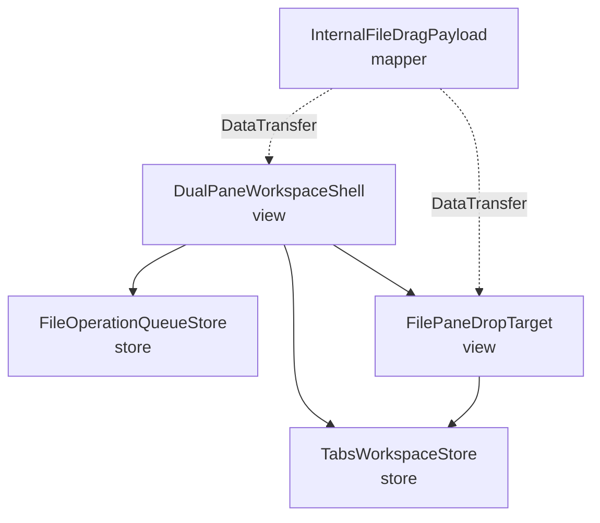
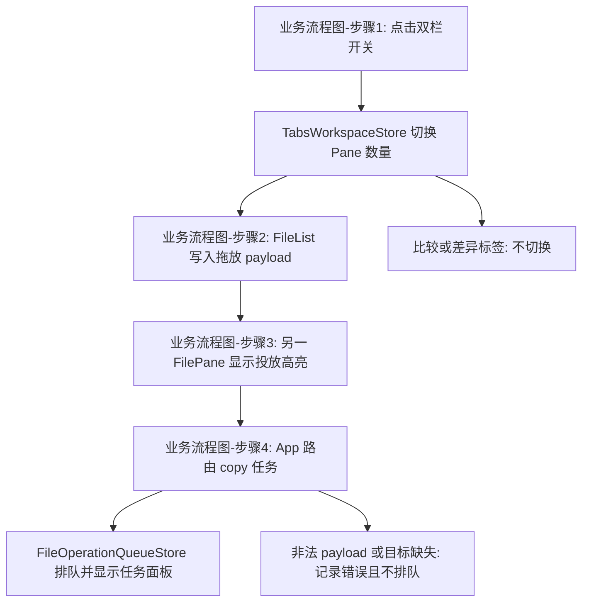

# 双目录文件操作 — 架构文档

## 一、模块结构图

依赖方向为 View → Store；拖放 payload 是短生命周期边界数据，不拥有或修改共享状态。文件复制由现有队列执行，UI 不直接写文件。

## 二、业务流程图

- 业务流程图-步骤1：`DualPaneWorkspaceShell` 调用 `TabsWorkspaceStore.toggleActiveSplit`。普通标签从单栏切换为双栏时，第二面板使用当前设备根目录；关闭时保留第一个面板。
- 业务流程图-步骤2：`InternalFileDragPayload` 由 `FileList.handleDragStart` 写入 `application/json`，包含源 pane、源设备和选中文件路径。
- 业务流程图-步骤3：`FilePaneDropTarget` 用组件局部计数管理 dragenter、dragleave 与 drop 的高亮，且点击面板会更新活跃面板。
- 业务流程图-步骤4：`DualPaneWorkspaceShell.handleDrop` 校验 payload、忽略同面板投放，然后调用 `FileOperationQueueStore.createCopyTask`。队列错误带来源和目标上下文记录。

## 三、角色职责清单

| 角色 | 类型 | 层 | 职责 | 隐藏秘密 | 数据所有权 | 依赖 | 设计原则 |
|---|---|---|---|---|---|---|---|
| TabsWorkspaceStore | 分层 | store | 维护普通标签的单双面板转换和活跃面板不变量 | 第二面板构造、关闭和持久化兼容规则 | tabs、activeTabId、Pane 与 activePaneId | — | SRP、信息隐藏、防御式设计 |
| DualPaneWorkspaceShell | 分层 | view | 呈现双栏入口并把跨面板投放转为复制请求 | 工具栏入口和目标面板路由 | 无持久状态 | TabsWorkspaceStore、FileOperationQueueStore、FilePaneDropTarget | SRP、关注点分离、依赖方向 |
| InternalFileDragPayload | 分层 | mapper | 定义并序列化内部拖放来源信息 | DataTransfer JSON 字段兼容性 | 一次拖放事件的不可变 payload | — | ISP、防御式设计、信息隐藏 |
| FileOperationQueueStore | 分层 | store | 创建并观测复制队列任务 | IPC 与后台队列调用细节 | 活动任务、历史任务和任务面板可见性 | — | SRP、关注点分离、信息隐藏 |
| FilePaneDropTarget | 分层 | view | 呈现单目录面板的活跃态和投放高亮 | 拖放高亮生命周期 | 组件局部计数和高亮状态 | TabsWorkspaceStore | SRP、关注点分离、高内聚低耦合 |

领域角色未纳入本 feature：文件复制、冲突策略和队列不变量仍由既有操作模块处理；本次只连接现有 UI 与队列边界，没有引入新的领域一致性规则。

## 四、质量属性与方案取舍

| 质量属性 | 场景 | 验收标准 |
|---|---|---|
| 复制正确性 | 从远程或本地面板拖入另一面板 | payload 必含源 deviceId；复制任务使用该值 |
| 状态一致性 | 开启或关闭双栏 | 普通标签保有一或两个面板，activePaneId 有效 |
| 可维护性 | 后续修改浏览或队列 | 不建立第二套 Pane 或复制实现 |
| 可发现性 | 单标签启动 | 主工具栏可直接开启双栏 |

候选方案：

1. `ALT-1`：扩展既有 `tabs` Store，追加或移除第二个 `Pane`，由 App 工具栏触发，并保留 App 的复制路由。
2. `ALT-2`：新增独立双栏 Store 和容器，维护与标签页并行的目录状态。

选择 `ALT-1`。它复用现有 `Pane`、持久化、`FilePane` 和 `fileOperations` 队列，满足复制正确性和状态一致性；`ALT-2` 会造成路径、历史、选择和活跃态的双重事实源。自顶向下流程与自底向上代码检查都表明现有结构仅缺少可达入口、第二面板 action 与完整拖放来源字段。设计强度为 `standard`，用户已确认候选选择。

## 五、设计依据

### TabsWorkspaceStore

- 划分理由：单双栏转换、第二面板默认值和活跃面板修正由同一状态所有者完成。
- 原则：SRP 令 Store 只维护标签工作区状态；信息隐藏隔离构造策略；防御式设计固定面板数量和 activePaneId 不变量。
- 业界来源：Pinia feature store。

### DualPaneWorkspaceShell

- 划分理由：View 只表达工具栏入口和投放路由，不接管 Pane 持久化或后台文件写入。
- 原则：SRP 与关注点分离使布局、状态和队列各有单一变化原因；依赖方向保持 View 消费 Store。
- 业界来源：Vue 页面组合组件与单向数据流。

### InternalFileDragPayload

- 划分理由：源设备、源面板和路径属于拖放边界协议，应避免由多个 View 分别猜测来源。
- 原则：ISP 保持 payload 只含复制所需字段；防御式设计拒绝缺少 deviceId 的内部投放；信息隐藏收敛 DataTransfer JSON。
- 业界来源：前端事件 DTO 与边界映射。

### FileOperationQueueStore

- 划分理由：复制任务、IPC 和进度属于既有队列能力，双栏 View 只提交明确参数。
- 原则：SRP 与关注点分离避免 UI 直接写文件；信息隐藏隔离后台实现变化。
- 业界来源：Pinia application store。

### FilePaneDropTarget

- 划分理由：高亮是面板实例的短生命周期展示状态，不应污染共享 Store。
- 原则：SRP 让组件只处理投放反馈；关注点分离保持队列创建在 App；高内聚低耦合限制视觉状态影响范围。
- 业界来源：Vue feature component。

### UI 架构决策

框架为 Vue 3 + Electron renderer。当前和目标模式均为 Direct View + Redux/Store：tabs Store 持有目录工作区状态，fileOperations Store 持有复制队列，FilePane 只持有高亮。MVVM 不适用，新增 ViewModel 只会转发现有 Store action，不能减少依赖；迁移影响为 low，且没有迁移确认需求。

## 六、关键接口契约（P0）

### TabsWorkspaceStore.toggleActiveSplit

- Provider / consumer：TabsWorkspaceStore 提供，DualPaneWorkspaceShell 和 FilePaneDropTarget 使用。
- 输入：无参数，读取当前 activeTab；输出：`boolean` 表示是否完成普通标签切换。
- 前置：当前标签存在且不是比较或文件差异视图。
- 后置：开启后有两个 Pane，第二 Pane 位于当前设备根目录；关闭后仅保留第一个 Pane。
- 不变量：普通标签只允许一或两个 Pane，activePaneId 始终属于当前标签。
- 错误：不满足前置时返回 `false`，不抛出异常。
- 数据所有权：TabsWorkspaceStore 独占修改 tabs；事务：not_applicable；并发：浏览器单线程切换。

### InternalFileDragPayload.serialize

- Provider / consumer：InternalFileDragPayload 提供，DualPaneWorkspaceShell 消费。
- 输入：paneId、deviceId 与非空文件路径数组；输出：`application/json` DataTransfer 文本。
- 前置：拖动项目属于源 Pane，deviceId 非空。
- 后置：解析后保留相同的 paneId、deviceId 和路径顺序。
- 不变量：内部 payload 不允许缺少 source deviceId。
- 错误：解析失败时记录错误，不创建复制任务。
- 数据所有权：payload 在 DataTransfer 生命周期内只读；事务：not_applicable；并发：每次 drop 至多创建一个任务。

### FileOperationQueueStore.createCopyTask

- Provider / consumer：FileOperationQueueStore 提供，DualPaneWorkspaceShell 消费。
- 输入：来源设备、来源路径、目标设备、目标目录与既有冲突策略；输出：FileOperationTask。
- 前置：来源和目标 Pane 存在，来源路径非空，目标不是来源 Pane。
- 后置：创建 `copy` 任务并显示任务面板。
- 不变量：跨面板拖放始终复制，不因 Alt 键转为移动。
- 错误：IPC 或队列失败时保留已有失败状态，App 日志记录来源与目标上下文。
- 数据所有权：路径是调用快照，任务和进度归 FileOperationQueueStore；事务：后台队列负责；并发：队列负责任务并发与取消。

## 七、验证证据

- `npm run typecheck`：通过，`vue-tsc --noEmit` exit 0。
- `npm run build`：通过，`electron-vite build` exit 0。
- `git diff --check`：通过，无空白错误。
- 静态检查：通过。`toggleActiveSplit` 保证第二 Pane 使用源设备根目录，并在关闭时修正 activePaneId；`handleDragStart` 写入 deviceId；`handleDrop` 只调用 `createCopyTask`。
- 手动代码复核：通过。`FilePane.handleDrop` 只清理高亮，复制任务只由 App 创建一次。
- 日志复核：通过。`FileOperationQueueStore.createCopyTask` 在入队、成功和异常路径记录来源、目标、文件数量和错误上下文。

## 八、已知缺口

- 真实 Electron 窗口中的鼠标拖放和高亮时序尚未在自动化环境复现；影响是类型检查和构建不能证明原生 dragenter、dragleave、drop 的视觉效果。后续阶段是在本地窗口分别从本地和远程目录执行一次跨面板拖放。
