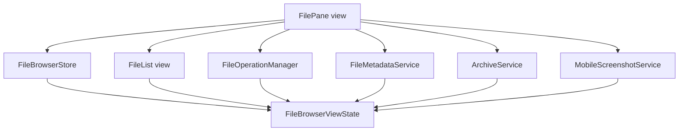
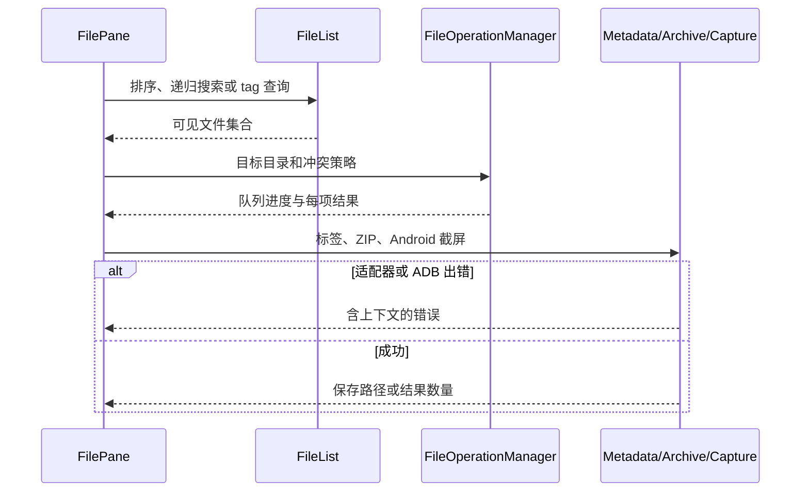

# 文件浏览与移动设备操作 — 架构文档

## 一、模块结构图

## 二、业务流程图

### 浏览、排序与搜索

1. FilePane 读取 FileBrowserStore 的窗格状态并传给 FileList。
2. FileList 在当前目录或递归结果中排序；`tag:work` 查询应用元数据集合。

### 目标目录与冲突策略

1. FilePane 打开目标设备与目录对话框。
2. FileOperationManager 将每个文件按 skip、overwrite 或 rename 处理，并把结果广播到队列。

### 标签集合

1. 信息对话框读取并编辑标签。
2. FileMetadataService 使用 deviceId 与 path 写入应用配置。

### ZIP

1. FilePane 请求创建或解压 ZIP。
2. ArchiveService 经 DeviceManager 读写当前适配器，并拒绝路径穿越条目。

### 回收与恢复

1. 本地文件进入系统废纸篓；远端或移动设备移入同级 `.fileman-recycle-bin`。
2. 最近一个远端回收任务可生成 restore 队列任务。

### Android 截屏

1. FilePane 只在 Android 设备显示截屏入口。
2. MobileScreenshotService 调用 ADB，验证 PNG 后通过 DeviceManager 写入当前目录。

## 三、角色职责清单

| 角色 | 类型 | 层 | 领域角色 | 职责 | 依赖 | 业界做法依据 | 设计原则 |
|---|---|---|---|---|---|---|---|
| FileBrowserStore | 分层 | store | — | 保存窗格视图状态 | FileBrowserViewState | Vue Pinia feature store | SRP、关注点分离 |
| FilePane | 分层 | view | — | 编排 UI intent | Store、服务与 FileList | Vue container component | SRP、依赖方向 |
| FileList | 分层 | view | — | 虚拟列表、排序与搜索 | FileBrowserViewState | Vue virtualized list component | SRP、关注点分离 |
| FileOperationManager | 分层 | application | — | 队列、冲突、改名、回收 | FileBrowserViewState | Application service with adapter port | SRP、DIP、OCP |
| FileMetadataService | 分层 | service | — | 标签元数据 | FileBrowserViewState | Application metadata repository service | SRP、DIP |
| ArchiveService | 分层 | service | — | ZIP 创建与解压 | FileBrowserViewState | Archive application service | SRP、DIP |
| MobileScreenshotService | 分层 | infrastructure | — | ADB 截屏与保存 | FileBrowserViewState | Infrastructure adapter around ADB process | SRP、DIP |
| FileBrowserViewState | 领域 | domain | 值对象 | 排序、冲突和标签类型 | — | DDD value object | value object、内聚 |

## 四、设计依据

### FileBrowserStore

FileBrowserStore 仅保留跨组件的展示状态，依据 SRP 与关注点分离，避免把 IPC 细节带入 Pinia。

### FilePane

FilePane 负责 intent 编排而非设备协议，依据 SRP 与依赖方向；它依赖稳定的 preload API。

### FileList

FileList 只处理可见集合与列表交互，依据 SRP 和关注点分离，目录访问仍由 IPC 完成。

### FileOperationManager

FileOperationManager 聚合队列和冲突决策，依据 SRP、DIP 与 OCP；具体文件系统动作经适配器端口执行。

### FileMetadataService

FileMetadataService 把应用标签与远端文件内容分离，依据 SRP、DIP 和关注点分离，避免污染设备文件。

### ArchiveService

ArchiveService 专注 ZIP 字节编排，依据 SRP 和 DIP，通过 DeviceManager 支持现有适配器。

### MobileScreenshotService

MobileScreenshotService 隔离 ADB 子进程调用，依据 SRP、DIP 和关注点分离；能力门控避免非 Android 路径调用它。

### FileBrowserViewState

FileBrowserViewState 用命名类型替代散落基础字符串，依据 value object 与高内聚低耦合原则。

UI 架构决定：当前与目标均为 Vue 3 的 Pinia store 加 Direct View。TabsStore 保持路径和选择的单一事实源；FileBrowserStore 只补充视图状态。功能虽含异步状态，但既有组件已经通过 store 与 IPC 编排，迁移到 MVVM 会扩展标签、预览与拖放边界，因此不采用 ViewModel。

## 五、关键接口契约

- `window.fileman.createFileOperation` 接收 `conflictStrategy` 和 `renameItems`，主进程回传逐项结果。
- `window.fileman.setFileTags(deviceId, path, tags)` 返回规范化后的标签。
- `window.fileman.createArchive` 与 `extractArchive` 只接受当前适配器可写目录。
- `window.fileman.captureMobileScreenshot` 仅接受 Android deviceId；返回保存后的 PNG 路径。

## 六、已知缺口 / 未决

无。
