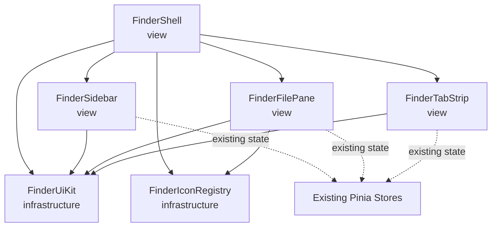
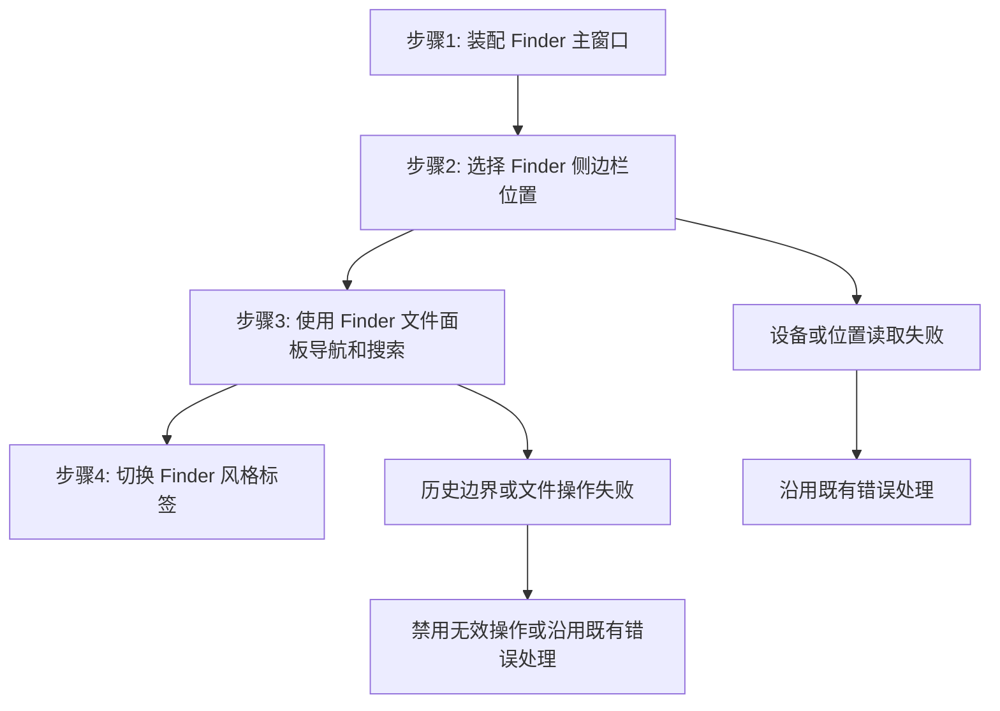

# Finder 风格界面层 — 架构文档

## 一、模块结构图

依赖方向保持为 View → UI infrastructure；Pinia Store 继续提供既有业务与展示状态，不依赖 Finder UI 层。

## 二、业务流程图

- 业务流程图-步骤1：FinderShell 装配 FinderUiKit 和 FinderIconRegistry，主题状态仍由 App 管理。
- 业务流程图-步骤2：FinderSidebar 将位置选择委派给已有 Pinia Store。
- 业务流程图-步骤3：FinderFilePane 保留已有导航、搜索与文件操作调用。
- 业务流程图-步骤4：FinderTabStrip 保留已有标签切换和关闭规则。

## 三、角色职责清单

| 角色 | 类型 | 层 | 领域角色 | 职责 | 依赖 | 业界做法依据 | 设计原则 |
|---|---|---|---|---|---|---|---|
| FinderShell | 分层 | view | — | 组合窗口标题栏、侧边栏、标签栏、文件区域和状态栏 | FinderUiKit, FinderIconRegistry | Vue 页面组合组件 | SRP、关注点分离 |
| FinderSidebar | 分层 | view | — | 呈现位置、设备和收藏导航并转发选择意图 | FinderUiKit、既有 Pinia Store | Vue smart component | SRP、关注点分离、依赖方向 |
| FinderFilePane | 分层 | view | — | 呈现路径栏、导航、搜索和视图控件 | FinderUiKit, FinderIconRegistry、既有 Pinia Store | Vue feature component | SRP、关注点分离、依赖方向 |
| FinderUiKit | 分层 | infrastructure | — | 提供 Finder scoped token 和控件样式 | — | Design token / scoped stylesheet | SRP、高内聚低耦合、关注点分离 |
| FinderIconRegistry | 分层 | infrastructure | — | 映射有来源记录的 SVG 图标并输出无障碍图标 | — | 静态资源 registry / presentational component | SRP、DIP、ISP |
| FinderTabStrip | 分层 | view | — | 呈现紧凑标签栏并委派标签动作 | FinderUiKit、既有 Pinia Store | Vue reusable component | SRP、关注点分离、依赖方向 |

领域角色经审查后未采用：此需求不变更文件、设备、标签或传输的业务不变量；它仅调整上述既有领域对象的表现层。把视觉 token 建模为聚合或实体不会带来一致性边界，因此不符合 DDD 的适用前提。

## 四、设计依据

### FinderShell

- 划分理由：窗口组合与文件、设备、预览状态分开，避免根组件成为新的业务状态源。
- 依据原则：SRP 让它只负责屏幕编排；关注点分离使 UI 组合不接管 Store 行为。
- 业界来源：Vue 页面组合组件。

### FinderSidebar

- 划分理由：侧边栏只改变导航表达，不复制设备、卷和收藏状态。
- 依据原则：SRP 将导航渲染与数据所有权分离；依赖方向保持为 View 消费 Store。
- 业界来源：Vue smart component。

### FinderFilePane

- 划分理由：文件面板将 Finder 控件视觉与现有文件操作分离，复用现有导航、搜索与排序调用。
- 依据原则：SRP 避免将样式 token 塞入 Store；关注点分离令业务动作继续处于已有 Store 与 IPC 边界。
- 业界来源：Vue feature component。

### FinderUiKit

- 划分理由：将颜色、半透明 chrome、分隔线、选择态和紧凑控制尺寸汇聚到受 `.finder-shell` 限制的样式层。
- 依据原则：高内聚低耦合使风格调整集中，且不扩散到非主窗口 UI；关注点分离使 CSS 不承担行为。
- 业界来源：Design token 与 scoped stylesheet。

### FinderIconRegistry

- 划分理由：将 Lucide SVG 的路径与许可入口集中，调用方只提供语义名称。
- 依据原则：DIP 让组件依赖语义映射而非嵌入路径；ISP 保持图标组件 props 精简；SRP 让资源注册独立于布局。
- 业界来源：静态资源 registry 与 presentational component。

### FinderTabStrip

- 划分理由：标签条仅改变紧凑 Finder 外观，标签生命周期仍由 tabs Store 管理。
- 依据原则：SRP 隔离标签视觉，依赖方向避免 Store 了解 View 的样式。
- 业界来源：Vue reusable component。

### UI 架构决策

当前和目标都采用 Direct View + Redux/Store：Pinia 是 tabs、file-browser、devices、favorites、preview 和 operations 的单一事实源。此次变更为纯表现层，创建 ViewModel 只能转发现有 actions，不能减少耦合，因此 `view_model_policy=not_used`、迁移影响为 none。

## 五、关键接口契约

- `FinderIcon`：输入 `name`、可选 `label` 和 `decorative`；输出带对应静态 SVG URL 与合适 `alt`/`aria-hidden` 的图标。
- `FinderUiKit`：只允许 `.finder-shell` 后代选择器；不得写入 Store、IPC 或组件业务逻辑。
- `FinderSidebar`、`FinderFilePane`、`FinderTabStrip`：保持既有 Pinia action、props 和事件契约，不通过样式变更修改状态所有权。

## 六、已知缺口 / 未决

- 尚未收到 Finder 参考截图；影响是颜色、字号和比例只能依据确认过的文本 UI 基线，下一阶段应补充截图文本图确认并执行同配置渲染对比。
