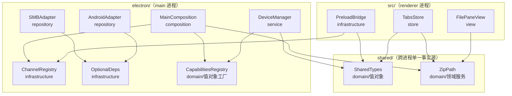
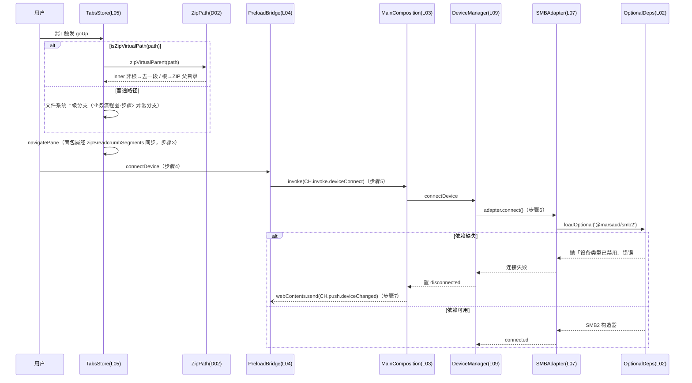

# IPC 契约与域类型单一事实源收敛 — 架构文档

> 落实 `docs/superpowers/2026-08-14-arch-risk-deep-dive-and-refactor-plan.md` 的 RISK-01 Phase A/B、RISK-02、RISK-03 第 1 步、RISK-05 共 5 项重构。除删除 3 个死 IPC 通道外零运行时行为变更。

## 零、用户确认记录

- 等级选择：用户选择 `standard`（消息中明确回复「standard（推荐）」，并选定范围=前三项+第4项主进程小整理）。
- 当前方案版本：`1`（proposal_revision）。
- 方案确认：用户在完整方案展示（ALT-1 shared/ 归属 + ALT-A CH 常量表 + 12 角色与 6 接口契约）后的后续消息中回复「确认，按方案编码」。

## 一、模块结构图

依赖方向全部单向：shared 层被两侧消费、不反向依赖任何进程；main 与 renderer 之间仅经 IPC（ChannelRegistry 常量 + PreloadBridge 桥接）；无环。

## 二、业务流程图

主流程 A：ZIP 向上导航（步骤 1-3）；主流程 B：SMB 缺依赖连接（步骤 4-7）。步骤与下图的对应：

| 契约步骤 | 落点 | 说明 |
|---|---|---|
| 业务流程图-步骤1 | `tabs.ts:goUp` | 用户在 ZIP 内触发向上导航 |
| 业务流程图-步骤2 | `tabs.ts:goUp` + `zipPath.ts:zipVirtualParent` | 判定虚拟路径并计算上级目标（无 `::` → 普通路径分支） |
| 业务流程图-步骤3 | `FilePane.vue:pathSegments` | 导航生效，面包屑经 zipBreadcrumbSegments 同步 |
| 业务流程图-步骤4 | `preload.ts:connectDevice` | renderer 发起设备连接 |
| 业务流程图-步骤5 | `main.ts:deviceConnect` handler | main 路由连接请求到 DeviceManager |
| 业务流程图-步骤6 | `SMBAdapter.ts:connect` + `optionalDeps.ts:loadOptional` | 延迟加载可选依赖（缺失 → 抛禁用错误） |
| 业务流程图-步骤7 | `main.ts:notifyRenderer` | 设备状态经 CH.push.deviceChanged 推送回 renderer |

## 三、角色职责清单

| 角色 | 类型 | 层 | 职责 | 隐藏秘密 | 数据所有权 | 依赖 | 设计原则 |
|---|---|---|---|---|---|---|---|
| SharedTypes | 领域 | domain | 声明跨进程域类型单一事实源（13 类） | 域模型形状（rootPath 必填 + config 可选正典） | 无状态（纯类型） | — | value_object、information_hiding、high_cohesion_low_coupling |
| ZipPath | 领域 | domain | ZIP 虚拟路径协议纯函数（parse/join/parent/segments） | `::` 分隔符与结尾 `/` 归一化规则 | 无状态（纯函数） | — | domain_service、SRP、information_hiding |
| CapabilitiesRegistry | 领域 | domain | 6 套设备能力常量 + 未连接兜底工厂 | 能力差异矩阵与兜底策略 | 无状态（常量+纯工厂） | SharedTypes | value_object、high_cohesion_low_coupling、SRP |
| ChannelRegistry | 分层 | infrastructure | 全部 IPC 通道名常量（CH.invoke/push/send） | 通道字符串拼写与命名空间前缀 | 无状态（as const 常量表） | — | separation_of_concerns、defensive_design |
| OptionalDeps | 分层 | infrastructure | loadOptional 统一延迟加载与降级错误 | 加载策略差异与失败语义 | 无状态（缓存归调用方） | — | SRP、defensive_design |
| MainComposition | 分层 | composition | 装配服务单例、注册 handler（经 CH）、显式启动扫描、ZIP 特判委托 ZipPath | 进程装配与通道→服务路由 | mainWindow 与 13 服务单例 | ChannelRegistry、ZipPath、CapabilitiesRegistry | separation_of_concerns、dependency_direction |
| PreloadBridge | 分层 | infrastructure | contextBridge 唯一暴露 window.fileman；方法↔通道经 CH 对应 | IPC 序列化边界与 API 表面 | 无持久状态 | SharedTypes、ChannelRegistry | separation_of_concerns、defensive_design |
| TabsStore | 分层 | store | 标签/面板状态；goUp 委托 zipVirtualParent | 标签/面板状态模型与持久化策略 | Tab/Pane 状态（localStorage 防抖持久化） | SharedTypes、ZipPath | SRP、separation_of_concerns |
| FilePaneView | 分层 | view | 双面板 UI；面包屑/ZIP 判断委托 ZipPath | 面板交互呈现细节 | 组件局部 UI 状态 | ZipPath | separation_of_concerns、tell_dont_ask |
| SMBAdapter | 分层 | repository | SMB 协议适配；smb2 延迟加载 | SMB 协议细节与库加载方式 | SMB2 client 句柄（连接生命周期） | OptionalDeps | SRP、defensive_design |
| AndroidAdapter | 分层 | repository | Android adb 适配；adbkit 惰性加载 | adb 协议细节与 adbkit 加载方式 | adbkit client 句柄 | OptionalDeps | SRP、defensive_design |
| DeviceManager | 分层 | service | 设备注册/连接/代理；兜底委托 CapabilitiesRegistry；构造无副作用 | 设备生命周期与 adapter 注册表 | devices/adapters Map | SharedTypes、CapabilitiesRegistry | SRP、DIP |

## 四、质量属性与方案取舍

| 质量属性 | 优先级 | 场景 | 验收结果 |
|---|---|---|---|
| maintainability | high | 通道/域类型/ZIP 解析改一处全仓生效，typo 编译期暴露 | ✔ grep 断言四项全过 |
| consistency | high | 三处 ZIP 解析（实际发现 6 处方言）结果一致 | ✔ `'::'` 实现仅剩 shared/zipPath.ts |
| reliability | medium | 缺 smb2/adbkit 时 main 可启动、设备连接报已禁用 | ✔ 静态审查过（运行冒烟未执行，见缺口） |
| behavior_preservation | high | 除 3 死通道外零行为变更 | ✔ typecheck 零新增 + 构建过 + 通道 diff 仅少 3 死通道 |

**候选方案**：ALT-1 根目录 `shared/` + 双构建 alias（**选定**）；ALT-2 放 `src/shared/` 主进程跨树引用（否决：主进程反向依赖 renderer 树，违反 dependency_direction）；ALT-3 codegen 生成三份副本（否决：生成器复杂度大于问题，违背 minimize_complexity/YAGNI）。通道形态选 ALT-A 常量对象（表驱动生成 filemanAPI 留作 Phase C，收益递减）。

**选择理由**：maintainability/consistency 为 high，ALT-1 是唯一同时让类型与运行时函数单源且依赖方向干净的方案；构建配置一次性成本被 typecheck 门禁覆盖。

**自顶向下**：从 ZIP 导航、缺依赖连接、能力兜底三条业务流推导出 5 个新角色 + 7 个改造角色。**自底向上**：renderer 全部 Device 构造点带 rootPath 兜底（devices.ts），正典必填不破坏现有代码；env.d.ts 全局脚本文件须用 `import()` 类型形态；tsconfig composite 引用链与 shared 双归属冲突 → 解除 composite（仓库无构建依赖 project references，打包全靠 vite），此为实现期回退修订点（契约允许演化，已同步）。

**风险 spike**：无（standard 且零行为变更，无技术不确定性）。**评审**：独立新视角语义复核，无阻断性发现。

## 五、设计依据

### SharedTypes（shared/types.ts）
- 划分理由：Device/DeviceConfig 等域类型此前 6 处手抄且已漂移（rootPath 可选性分叉），跨进程契约必须单源。
- 依据原则：information_hiding（隐藏域模型形状这一易变决定）；high_cohesion_low_coupling（契约集中消六处耦合）。
- 业界来源：DTO/共享内核（Shared Kernel，DDD 战略设计）。

### ZipPath（shared/zipPath.ts）
- 划分理由：`'::'` 协议有 6 份方言实现（main.ts、tabs.ts、FilePane×2、FileList×2），边界处理已不一致；协议操作是无身份值的纯函数，收敛为单一领域服务模块。
- 依据原则：domain_service（跨视图的路径值操作）；SRP（只管协议解析/构造/导航）；information_hiding（归一化规则单点）。
- 业界来源：DDD 值对象 + 领域服务。

### CapabilitiesRegistry（capabilities.ts 扩展）
- 划分理由：兜底能力对象原内联在 DeviceManager.getCapabilities，与 6 套能力声明分居两处，同类知识应同址。
- 依据原则：high_cohesion_low_coupling；value_object（能力为不可变声明式数据）。
- 业界来源：DDD 值对象 + 工厂。

### ChannelRegistry（electron/src/ipc/channels.ts）
- 划分理由：通道字符串两处手写（58 vs 54 已现漂移、3 死通道），协议标识符应集中声明防拼写漂移。
- 依据原则：defensive_design（typo 编译期拦截）；separation_of_concerns（协议标识与业务逻辑分离）。
- 业界来源：API 路由常量模块（DRY 惯例）。

### OptionalDeps（electron/src/adapters/optionalDeps.ts）
- 划分理由：4 个可选依赖 4 种加载点、2 种失效模式（启动崩溃 vs 连接禁用），统一失败语义是独立且易变的责任。
- 依据原则：SRP（只管加载与降级错误）；defensive_design（错误必含依赖 id 与禁用语义）。
- 业界来源：优雅降级 + 统一资源加载器惯例。

### MainComposition（main.ts）
- 划分理由：组合根集中装配与路由注册；ZIP 特判解析下沉到 shared、扫描启动显式化（构造无副作用原则）。
- 依据原则：separation_of_concerns；dependency_direction（入口只装配路由，不承载协议细节）。
- 业界来源：Composition Root（组合根惯例）。

### PreloadBridge（preload.ts + env.d.ts）
- 划分理由：IPC 序列化边界唯一暴露点；类型与通道均消费单一事实源后，桥自身只剩映射职责。
- 依据原则：defensive_design（contextIsolation 单点暴露）；separation_of_concerns。
- 业界来源：防腐层/桥接（Electron 安全惯例）。

### TabsStore / FilePaneView
- 划分理由：状态与视图各自职责不变，仅把路径协议计算委托给领域模块（Tell-Don't-Ask：让领域模块提供 parent/segments 行为，而非视图自算）。
- 依据原则：SRP；tell_dont_ask；separation_of_concerns。
- 业界来源：Pinia 共享 store / Vue 视图组件惯例。

### SMBAdapter / AndroidAdapter
- 划分理由：协议适配职责不变；可选依赖加载点从模块顶层移入 connect() 路径，失效模式从进程崩溃改为设备禁用。
- 依据原则：SRP；defensive_design。
- 业界来源：端口-适配器（Adapter）+ 优雅降级。

### DeviceManager
- 划分理由：设备生命周期职责不变；能力兜底委托 CapabilitiesRegistry、扫描启动移交组合根，构造函数不再有生命周期副作用。
- 依据原则：SRP（一个变化理由）；DIP（能力策略依赖声明模块而非内联）。
- 业界来源：应用服务 + 注册表模式。

**UI 架构决策**：框架 Vue 3；当前/目标模式均为 Redux/Store（Pinia）+ Direct View；view_model_policy=not_used；mvvm_suitability=not_suitable（本 feature 仅替换视图内纯函数调用，不改状态边界与页面状态转换）；migration_impact=none、migration_confirmation=not_required——机械引入 ViewModel 反增复杂度，与 ui-architecture-policy 一致。

## 六、关键接口契约（P0）

- **IFC-1 ZipPath.parseZipVirtualPath / joinZipPath**（provider ZipPath；consumers MainComposition/TabsStore/FilePaneView）：输入任意路径；输出 `{zipFilePath, innerPath}`，innerPath 无结尾 `/`、`''` 为 ZIP 根；容错无 `::` 输入；**不变量 joinZipPath(parse(p)) === 归一化(p)**；纯函数不抛错；事务/并发 not_applicable。
- **IFC-2 ZipPath.zipVirtualParent**（provider ZipPath；consumer TabsStore）：inner 非根→去一段；inner 为根→ZIP 文件所在文件系统父目录（'/' 兜底）；**不变量：连续调用收敛到 '/'**。
- **IFC-3 ChannelRegistry.CH**（provider ChannelRegistry；consumers MainComposition/PreloadBridge/FileOperationManager/TransferManager）：as const 常量；**后置：值与重构前通道字符串逐字相同（除删除的 3 个死通道）**；preload 与 main 同源，拼写漂移编译期暴露。
- **IFC-4 OptionalDeps.loadOptional**（provider OptionalDeps；consumers SMBAdapter/AndroidAdapter）：`loadOptional<T>(id, loader): Promise<T>`；**前置：调用点在 connect() 路径内；不变量：失败必抛含依赖 id 与『设备类型已禁用』语义的错误，不吞错**；模块缓存由调用方持有；并发 not_applicable（连接去重归 DeviceManager.connectionAttempts）。
- **IFC-5 SharedTypes 正典 Device/DeviceConfig**（provider SharedTypes；consumers Main/Preload/TabsStore/DeviceManager）：`rootPath: string` 必填 + `config?: DeviceConfig`（以主进程版本为准）；后置：三侧 import type 同一声明，本地重复声明全删。
- **IFC-6 CapabilitiesRegistry.DEFAULT_REMOTE_CAPABILITIES**（provider CapabilitiesRegistry；consumer DeviceManager）：未连接远程设备能力兜底，与原 DeviceManager 内联版本逐字段一致；不变量 canStream 恒 false。

## 七、验证证据

| 命令 | 结果 | 状态 |
|---|---|---|
| `npm run typecheck` | vue-tsc 0 错误 | ✔ passed |
| `npx tsc -p tsconfig.node.json --noEmit` | 16 处错误与 git stash 基线**完全一致**（零新增；本次涉及文件 0 错误） | ✔ passed（带存量说明） |
| `npm run build` | main/preload/renderer 三 bundle 构建成功；zipPath 打包进 main+renderer；preload 仅 type 消费 | ✔ passed |
| grep 单一源断言 | DeviceConfig 声明仅 shared/types.ts；`'::'`/ZIP_SEP 仅 shared/zipPath.ts；main/preload 裸通道 0（剩余引号串为 Electron 生命周期事件） | ✔ passed |

关键检查映射：maintainability→grep+tsc（过）；consistency IFC-1→实现审查+tsc（过）；behavior_preservation→通道 diff 仅少 3 死通道（过）；reliability→静态审查（过，运行冒烟未执行）；IFC-2 语义→逐分支比对（过）。

## 八、已知缺口 / 未决

- ⚠ `tsc -p tsconfig.node.json` 有 **16 处存量类型错误**（FileOperationManager TransferTask 字段等，经 stash 基线确认非本次引入）——影响：主进程类型门禁不干净，掩盖未来真实回归；后续：独立小任务修复（重建 TransferTask 与 CreateTaskParams 字段对齐）。
- ⚠ 删依赖运行冒烟未执行——影响：reliability 仅有静态证据，置信度中；后续：rename `node_modules/@marsaud/smb2` 验证 main 可启动后还原。
- ⚠ `npm run dev` 手测未执行——影响：ZIP 导航/面包屑行为保持仅有静态比对；后续：手测 ZIP 进入→向上→根退出→面包屑点击。
- ⚠ 脚本校验为结构性近似（文件存在/关键字/步骤对账），「职责是否真单一」属语义项，由新视角语义复核覆盖，无法机器证明。
- 未决问题：3 个已删死通道是否有仓库外消费方（如外部调试工具）——影响：若有则需恢复 handler；后续：确认无消费后维持删除，有则按 channels.ts 注释清单恢复。

（violation 处理：实现期发现 tsconfig composite 引用链与 shared 双归属冲突，已按契约回退机制解除 composite 引用并同步本档第四节——设计允许演化，变更已记录。）
