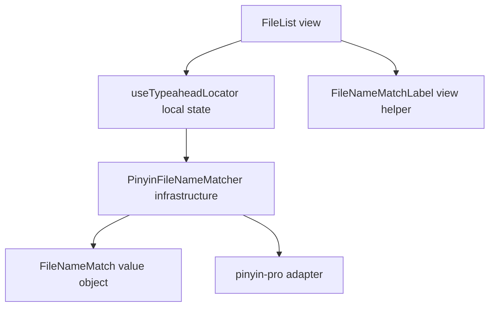
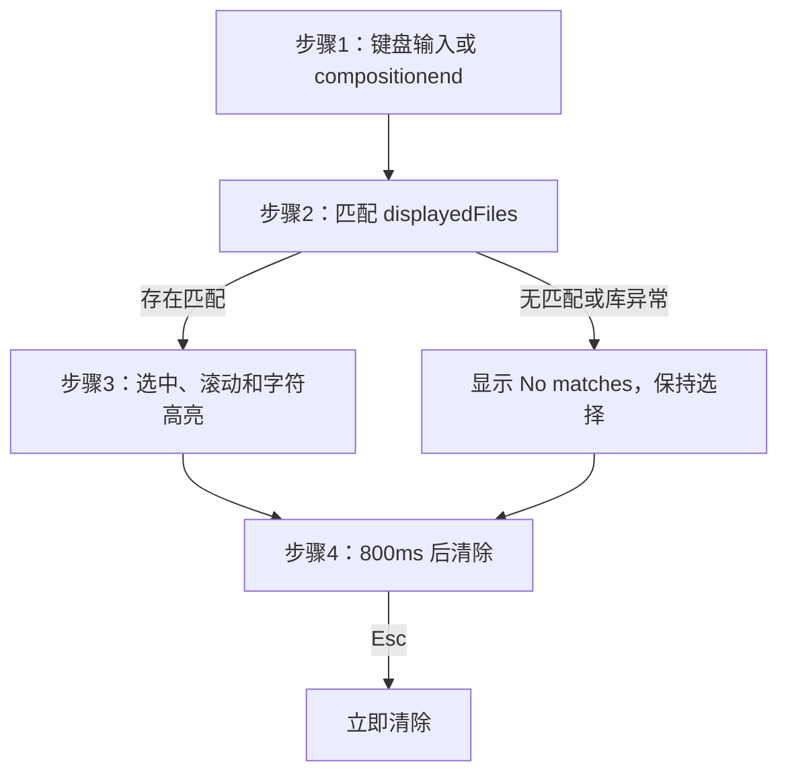

# 文件键盘定位与拼音匹配 — 架构文档

## 一、模块结构图

## 二、业务流程图

1. FileList 忽略来自搜索框、重命名框和其他可编辑元素的键盘事件；普通字符写入局部缓冲，中文输入法在 `compositionend` 一次性写入已提交文本。
2. `useTypeaheadLocator` 以当前 `displayedFiles` 计算匹配；匹配器先走大小写无关的原文前缀，再走连续的全拼、首字母或混合拼音前缀。
3. FileList 选择第一个匹配项，在列表、网格或分栏中把它滚入可视区域；`FileNameMatchLabel` 按字符位置渲染 `<mark>` 高亮。
4. 800ms 无新增输入即清除；Esc 在缓冲非空时优先清除缓冲，之后才继续已有的重命名取消语义。

## 三、角色职责清单

| 角色 | 类型 | 层 | 领域角色 | 职责 | 依赖 | 业界做法依据 | 设计原则 |
|---|---|---|---|---|---|---|---|
| FileList | 分层 | view | — | 捕获键盘、选择滚动并渲染提示与高亮 | PinyinFileNameMatcher | Vue virtualized list component 与 Composition API 局部 feature state | SRP、关注点分离、依赖方向 |
| PinyinFileNameMatcher | 分层 | infrastructure | — | 将名称和输入转换为原文或拼音前缀匹配 | FileNameMatch | Adapter around pinyin-pro text matching API | SRP、DIP、关注点分离 |
| FileNameMatch | 领域 | domain | 值对象 | 表达目标、策略和高亮字符位置 | — | DDD value object | value object、高内聚低耦合 |

## 四、设计依据

### FileList

- 划分理由：搜索过滤、选择和虚拟滚动已由 FileList 负责；定位只在此可见集合中发生。`useTypeaheadLocator` 与 `FileNameMatchLabel` 是该 View 的局部实现辅助，不成为跨 feature 的状态角色。
- 依据原则：SRP 使 View 只执行展示意图；关注点分离使工具栏过滤词不与键盘缓冲混用；依赖方向使 View 只消费匹配结果。
- 业界来源：Vue virtualized list component 与 Composition API 局部 feature state。

### PinyinFileNameMatcher

- 划分理由：拼音算法和第三方库选项集中在单一边界，列表、网格和分栏不复制规则。
- 依据原则：SRP 限定为名称匹配；DIP 令展示层依赖稳定的匹配结果；关注点分离隔离库异常。
- 业界来源：Adapter around pinyin-pro text matching API。

### FileNameMatch

- 划分理由：文件、策略和高亮位置必须一起表达，避免在模板中传递松散的路径和索引数组。
- 依据原则：value object 表达不可变结果；高内聚低耦合让高亮渲染无须理解拼音规则。
- 业界来源：DDD value object。

UI 架构决定：框架为 Vue 3；当前和目标均为 Pinia/Direct View。FilePane 保持过滤词的单一事实源，FileList 保持短暂定位状态。该状态同步、局部且无跨页复用需求，迁移到 MVVM 只会增加转发层，因此不采用 ViewModel；迁移影响为 low，用户已确认该局部方案。

## 五、关键接口契约（P1）

- `useTypeaheadLocator(files)` 返回 `query`、`matches`、`activeMatch`、`append(text)` 和 `clear()`；空格不能开启缓冲，换行与制表符不进入查询。
- `findFileNameMatches(files, query)` 仅返回前缀匹配；原文匹配优先于拼音匹配，拼音匹配返回对应文件名字符索引。
- `FileNameMatchLabel` 接收 `name`、`highlightIndices` 与 `selected`；始终通过 Vue 文本节点输出文件名，不使用 `v-html`。

## 六、已知缺口 / 未决

无。
