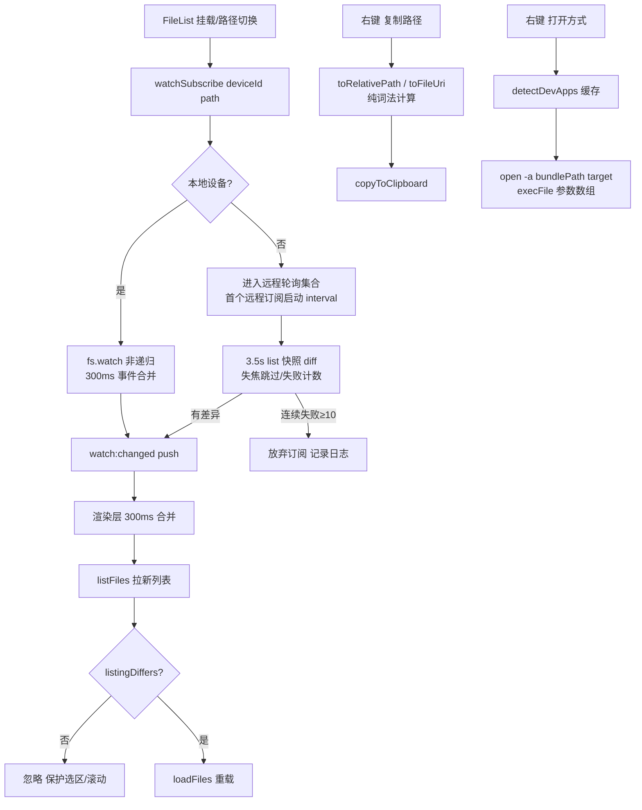

# 目录监听自动刷新 + 路径快赢（M1） — 架构文档

> 需求来源：`prd/2026-08-15-dir-watch-quickwin-requirements.md`（随总体规划批准）。
> 契约源：`docs/architecture/2026-08-15-dir-watch-quickwin-design-contract.json`（本文档为其人读渲染，两者一致）。

## 零、用户确认记录

- 等级选择：用户在「程序员工作台功能套件」总体规划阶段确认（放弃终端功能；grep 采用混合引擎），M1 套件按规划批准进入。
- 当前方案版本：`1`（proposal_revision）。
- 方案确认：用户批准完整实施计划（`~/.claude/plans/ancient-tickling-alpaca.md`）后进入编码。

## 一、模块结构图

```mermaid
flowchart TD
  subgraph View 层
    FL[FileList.vue<br/>自动刷新订阅 + 右键菜单扩展]
  end
  subgraph ViewModel / Store 层
    SET[settings store<br/>autoRefresh 开关]
    TABS[tabs store<br/>isTransientTab 提取]
  end
  subgraph Domain 层（纯函数）
    LD[listingDiff<br/>签名差异判定]
    PU[path utils<br/>toRelativePath / toFileUri]
  end
  subgraph Infrastructure 层（main 进程）
    WS[WatchService<br/>本地 fs.watch / 远程轮询]
    HSS[HostShellService<br/>openWith + detectDevApps]
  end
  subgraph Infrastructure 层（共享基建，M3/M4 复用）
    STR[SessionTaskRegistry]
    DW[DirectoryWalker]
    FH[fileHashing]
    TPR[ToolPathResolver 泛化]
    ULT[useLongTaskProgress<br/>renderer composable]
  end
  FL -->|watchSubscribe/Unsubscribe + onWatchChanged| WS
  FL --> LD
  FL --> PU
  FL --> SET
  FL -->|openWith / detectOpenWithApps| HSS
  WS -->|watch:changed push| FL
```

依赖方向声明：View → Store / Domain / Infrastructure（经 preload IPC）；Domain 不依赖任何层；Infrastructure 不反向依赖 View/Store。与既有架构一致（fileBrowser store 注释「Presentation state only, file I/O stays behind the preload API」）。

## 二、业务流程图



流程步骤与 contract `business_process[]` 一一对应（S1 订阅 / S2 本地监听 / S3 远程轮询 / S4 diff 守卫刷新 / S5 路径快赢）。

## 三、角色职责清单

| 角色 | 类型 | 层 | 职责 | 隐藏秘密 | 数据所有权 | 依赖 | 设计原则 |
|---|---|---|---|---|---|---|---|
| WatchService | class | infra(main) | 订阅登记、本地/远程引擎分流、变化推送 | fs.watch 事件语义、轮询周期与合并窗口、失败上限 | localWatches/remoteWatches/refCounts Map | DeviceAdapterProvider 窄接口、emit 回调注入 | SRP（只推送不决策）、DIP（不持 webContents）、策略模式 |
| listingDiff | 纯函数 | domain | 列表签名差异判定 | 签名构成（isDir+size+mtime+name） | 无状态 | FileInfo 类型 | 纯函数可单测 |
| path utils 扩展 | 纯函数 | domain | toRelativePath 词法相对路径、toFileUri 转义 | 分段上/下行算法、encodeURIComponent 规则 | 无状态 | — | 纯函数可单测 |
| FileList 自动刷新集成 | view 片段 | view | 订阅生命周期、事件合并、diff 守卫后 loadFiles | 挂载周期=展示周期这一对齐关系 | watchRefreshTimer 局部 | window.fileman、listingDiff、settings store | 生命周期对齐 |
| HostShellService 扩展 | class | infra(main) | openWith（open -a）、detectDevApps 探测缓存 | DEV_APP_CANDIDATES 白名单、/Applications 搜索、memoize | detectedAppsCache | execFile/fs/os | SRP、execFile 无 shell |
| 右键菜单扩展 | view 片段 | view | 复制路径/打开方式子菜单构建与分发 | 菜单快照（otherPane/targetFile）模式 | contextMenuOtherPanePath/openWithApps ref | path utils、clipboard、tabs store | 既有菜单模式沿用 |
| SessionTaskRegistry | class | infra(main) 共享 | 长任务登记/同 session 取消/取消钩子 | TaskHandle 状态机 | tasks/sessionTasks Map | — | DRY（两个既有服务手写模式抽出）、OCP（state 泛型） |
| DirectoryWalker | class | infra(main) 共享 | 顺序 BFS 遍历+协作取消+容错 | 连续失败上限、symlink 目录不递归 | 无（结果回调注入） | DeviceAdapterProvider | 模板方法变体 |
| fileHashing | 纯函数集 | infra(main) 共享 | 流式哈希/首块哈希/缓冲回退 | 32MB 回退上限、取消语义、流登记钩子 | 无 | IFileSystemAdapter、crypto | 从 ContentVerificationService 泛化（DRY） |

（另有三个小提取同批落地：`ToolPathResolver.resolveTool` 泛化（OCP：TOOLS 表加行即扩展）、`useLongTaskProgress` composable（renderer 侧三件套 harness）、`tabs.isTransientTab`（瞬态工具页单一事实源）——均无独立业务流程，归入共享基建角色叙述。）

## 四、质量属性与方案取舍

| # | 质量属性 | 优先级 | 场景 / 验收 |
|---|---|---|---|
| QA-1 | 选区/滚动保护 | P0 | 无变化推送后选中项与滚动位置不变（e2e 断言） |
| QA-2 | 及时性 | P0 | 本地变化 ≤1s 可见 |
| QA-3 | 资源即释 | P0 | 无订阅时零 watcher 零 interval |
| QA-4 | 设备友好 | P1 | 远程轮询单请求在途、失焦跳过 |
| QA-5 | 零新依赖 | P0 | 不引入 chokidar；ripgrep 捆绑属 M3 |

候选方案：
- ALT-1（选定）：FileList 持有订阅 + 渲染层 diff 守卫。优点：订阅生命周期与「目录正被展示」精确对齐；diff 用列表页已有数据，零额外主进程状态。缺点：FileList 再增职责（以注释与代码分段缓解）。
- ALT-2：FilePane 持有订阅 + directoryLoadKey 重挂载刷新。否决：重挂载丢滚动位置；FilePane 对非激活标签也存在，订阅范围大于展示范围。
- ALT-3：主进程 watch 后直接推送带明细的 diff。否决：主进程需缓存每目录基线列表（内存+失效复杂度），与「renderer 已有列表数据」重复。

自顶向下检查：需求 R1-R8 → 角色全覆盖（R2→listingDiff+FileList 守卫；R3→WatchService 引用计数；R4→轮询引擎；R5→isZipVirtualPath 分支；R6→path utils 纯函数；R7→HostShellService 门控；R8→settings）。自底向上检查：每个新模块均可被 ≥1 条规则追溯。

## 五、设计依据

- WatchService 分流策略：本地 fs.watch 非递归（FSEvents）事件只涉及直接条目，精确匹配「面板展示一层」的语义；SSH SFTP 协议无 inotify 通道，轮询是唯一途径（VolumeScanner setInterval 先例）。emit 回调注入沿用 compareVerifyStart 模式（服务不持 webContents，`isDestroyed` 守卫在组合根）。
- diff 守卫放渲染层：推送只发信号不带明细（IPC 轻量），比对复用列表页 `files` 现值，主进程无基线缓存。
- HostShellService 扩展沿用其「execFile 参数数组不经 shell」原则；探测白名单而非 LaunchServices 全扫描（成本/收益）。
- 共享基建：SessionTaskRegistry/DirectoryWalker/fileHashing 是既有两个手写模式（DirectoryStatsService、ContentVerificationService）的第 3..N 次复用点（DRY 时机成立），M3 的 grep/dupes 与 M4 的 space 直接消费；useLongTaskProgress 对应 renderer 侧同型重复。
- ContentVerificationService 改为委托 fileHashing：行为不变（sha256、取消语义、流登记），回归由既有 e2e compare 流程覆盖。

## 六、关键接口契约（P0）

### IFC-1 watch 订阅与推送（IPC 三通道）
- 提供者：WatchService（经 main.ts handler）；消费者：FileList。
- 输入：`watchSubscribe(deviceId, dirPath)` / `watchUnsubscribe(deviceId, dirPath)`。
- 输出：`{ ok: boolean }` / void；推送 `WatchChangeEvent { deviceId, dirPath }`（`watch:changed`）。
- 前置：dirPath 为非 ZIP 普通路径（渲染层已过滤 ZIP）；后置：引用计数 ±1，归零释放资源。
- 不变量：推送只表明「可能变化」，不保证有差异；同 (deviceId, dirPath) 并发订阅幂等（计数累加）。
- 错误：订阅失败（目录不存在）返回 ok 并记录，不抛 IPC 异常。
- 并发：本地 watcher error 后自动清订阅；远程轮询单飞行在途。

### IFC-2 打开方式（IPC 两通道）
- 提供者：HostShellService；消费者：FileList 右键菜单。
- 输入：`openWith(appPath, targetPath)`；`detectOpenWithApps()`。
- 输出：`void`；`OpenWithApp[] { id, name, bundlePath }`（memoized）。
- 不变量：execFile 参数数组，不经 shell 拼接；探测失败 → 空数组。
- 错误：open 失败 reject（renderer console 记录，不打断 UI）。

### IFC-3 listingDiff / toRelativePath / toFileUri（纯函数）
- 提供者：`src/utils/listingDiff.ts`、`src/utils/path.ts`；消费者：FileList。
- 不变量：listingDiffers 与顺序无关；toRelativePath 纯词法（不触 FS、不解析 symlink）；同路径得 `'.'`。
- 验证：`tests/relativePath.test.ts`（esbuild harness，14+ 断言）。

### IFC-4 共享基建接口（M3/M4 消费面）
- `SessionTaskRegistry.create(sessionId, state) → TaskHandle`（onCancel 钩子/finish 注销）；`cancel(taskId)` 同步执行钩子。
- `DirectoryWalker.walk(deviceId, root, isCancelled, cb) → WalkResult`；symlink 目录不递归。
- `hashAdapterFile / hashAdapterFileRange(adapter, path, size, [length], opts)`；取消抛 `'cancelled by request'`。
- `ToolPathResolver.getExecutable(name)` / `hasRipgrep()`；`useLongTaskProgress(api)`（shallowRef progress、taskId 过滤、卸载退订+取消）。

## 七、验证证据

| 命令 | 结果 | 证据 |
|---|---|---|
| `npm run typecheck` | exit 0 | renderer 全绿（0 error） |
| `npx tsc -p tsconfig.node.json` | 16 errors（=既有基线，零新增） | FileOperationManager 等既有错位，与本特性无关 |
| `npm run build` | exit 0 | out/ 三端产物生成 |
| `npm run test:relative-path` | ✓ 全部断言通过 | toRelativePath/toFileUri/listingDiffers 纯函数 |
| `npx playwright test e2e/watch-autorefresh.spec.ts e2e/copy-path.spec.ts` | 8 passed | 订阅建立/无变化不打扰选区/有变化刷新/异目录忽略/四路径变体 |

方法说明：typecheck/build 为 `static_check`；单测与 e2e 为 `new_test`（mock window.fileman Proxy，renderer-only，不启动 Electron）。

## 八、已知缺口 / 未决

- 远程轮询周期未按设备类型区分（统一 3.5s）——M3 设备感知增强时统一评估。
- `open -a` 对无关联类型的文件（如 Xcode 收到 .txt）可能只打开应用不定位文件——macOS 语义，可接受降级。
- fs.watch 对 /Volumes 网络卷（smb 挂载成本地路径浏览时）的及时性未实测——FSEvents 对网络卷可能延迟；此类卷本就常见于远程设备浏览路径。
- quick-look.spec.ts 存在 2 个与本套件无关的既有失败（在途 Finder 样式改造，选中类改 `finder-selected`），不在本套件修复范围。
- M3 落地 rg 捆绑前，`ToolPathResolver.hasRipgrep()` 已可用（$PATH 探测）。
