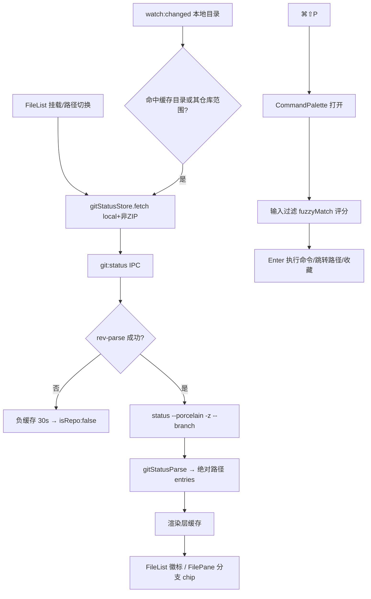

# Git 状态徽标 + 命令面板（M2） — 架构文档

> 需求来源：`prd/2026-08-15-git-palette-requirements.md`（随总体规划批准）。
> 契约源：`docs/architecture/2026-08-15-git-palette-design-contract.json`（本文档为其人读渲染，两者一致）。

## 零、用户确认记录

- 等级选择：standard（随总体规划批准，M2 套件无独立澄清）。
- 当前方案版本：`1`（proposal_revision）。
- 方案确认：规划批准记录（同 M1）。

## 一、模块结构图

```mermaid
flowchart TD
  subgraph View 层
    FB[FileGitBadge.vue<br/>徽标原子组件]
    FL[FileList.vue<br/>gitEntryMap + 三视图徽标]
    FP[FilePane.vue<br/>分支 chip]
    CP[CommandPalette.vue<br/>面板 UI]
    APP[App.vue<br/>⌘⇧P 绑定 + 内置命令播种]
  end
  subgraph ViewModel / Store 层
    GS[gitStatus store<br/>缓存/在途去重/watch 失效]
    CR[commandRegistry store<br/>命令注册表]
  end
  subgraph Domain 层（纯函数）
    GP[gitStatusParse<br/>porcelain -z 解析]
    FM[fuzzyMatch<br/>子序列评分]
  end
  subgraph Infrastructure 层（main）
    GSS[GitStatusService<br/>rev-parse + status execFile]
  end
  FL --> FB
  FL --> GS
  FP --> GS
  FL -->|getGitStatus IPC| GSS
  GSS --> GP
  CP --> CR
  CP --> FM
  APP --> CR
  APP --> CP
  GS -->|onWatchChanged 失效| M1[watch:changed（M1）]
```

依赖方向：View → Store → IPC → Infrastructure；Domain 纯函数被两侧消费。git 集成不经过 IFileSystemAdapter/DeviceManager（宿主工具链概念，非文件系统操作）。

## 二、业务流程图



## 三、角色职责清单

| 角色 | 类型 | 层 | 职责 | 隐藏秘密 | 数据所有权 | 依赖 | 设计原则 |
|---|---|---|---|---|---|---|---|
| GitStatusService | class | infra(main) | rev-parse + status 两次 exec、负缓存 30s | 超时 5s、maxBuffer、porcelain 路径相对仓库根 | notRepoUntil Map | execFile | SRP（只查询不缓存策略） |
| gitStatusParse | 纯函数 | domain | -z NUL 记录解析、R 原路径跟随、头解析 | NUL 记录状态机 | 无 | — | 纯函数可单测 |
| gitStatus store | store | viewmodel | (deviceId,dirPath) 缓存、在途去重、watch 失效重取 | 失效条件（本目录或仓库范围前缀） | cache Map | IFC-1、onWatchChanged | presentation-state 惯例 |
| FileGitBadge | 组件 | view | XY → 字母/kind 归并、徽标渲染 | 归并优先级 C>U>M>A>D>R、! 不展示 | 无 | — | 原子组件 |
| commandRegistry store | store | viewmodel | 命令注册/注销/清单 | id 去重、注册顺序稳定 | commands Map | — | OCP（面板不知具体命令） |
| CommandPalette | 组件 | view | 过滤评分排序、键盘导航、三类候选（命令/收藏/手输路径） | 捕获期按键消费（LIFO）、路径候选置顶 | 局部 query/activeIndex | fuzzyMatch、commandRegistry、favorites | 生命周期独立 |

## 四、质量属性与方案取舍

| # | 质量属性 | 优先级 | 场景 / 验收 |
|---|---|---|---|
| QA-1 | 只读安全 | P0 | 全程仅 status/rev-parse |
| QA-2 | 零开销退化 | P0 | 非仓库目录无 exec 风暴（双层缓存） |
| QA-3 | 及时性 | P1 | watch 联动徽标刷新（e2e） |
| QA-4 | 键盘正确性 | P0 | 面板按键不泄漏到 FileList（捕获期消费） |
| QA-5 | 视觉稳定性 | P0 | 徽标不改行高/滚动结构（RISK-04） |

候选：ALT-1（选定）git 集成为独立宿主级服务（不进 adapter）。ALT-2：作为 LocalAdapter 可选方法 —— 否决，git 非文件系统语义，污染 adapter 接口（ISP）。ALT-3：renderer 直接 spawn —— 否决，contextIsolation 下不可能且职责错位。

## 五、设计依据

- porcelain -z 格式稳定性承诺（跨版本）；R 原路径独立 NUL 记录是解析状态机核心。
- 双层负缓存：主进程 30s TTL（防导航风暴）+ 渲染层缓存（防重复 IPC）；正结果不缓存（本地 exec 便宜，watch 失效驱动重取）。
- 命令面板复用 FileNameMatchLabel 渲染高亮（indices 约定一致）；favorites 动态并入候选而非注册（避免生命周期同步问题）。
- 徽标 kind → CSS 变量映射（测试发现的坑：kind 必须与类名精确对应，已用 KIND_BY_LETTER 显式映射）。

## 六、关键接口契约（P0）

### IFC-1 git:status（IPC 单通道）
- 提供者：GitStatusService（main.ts handler 门控 local）；消费者：gitStatus store。
- 输入：`(deviceId, dirPath)`；输出：`GitDirectoryStatus { isRepo, repoRoot?, branch?, ahead?, behind?, entries[{path 绝对, x, y, renamedFrom?}] }`。
- 前置：本地设备（非 local 直接返回 isRepo:false）；后置：负结果进入 30s 缓存。
- 不变量：entries.path 恒为绝对路径（repoRoot + 相对路径）；失败不抛异常给渲染层（返回 isRepo:false 或空 entries）。
- 并发：多次快速调用幂等（execFile 并行安全，结果以后到者覆盖）。

### IFC-2 命令注册表（store API）
- `registerCommands(items)` / `unregisterCommands(ids)` / `allCommands`；命令 `run(ctx)` 返回 false 表示上下文不可用。
- 不变量：id 唯一（重复注册覆盖）；清单顺序 = 注册顺序（评分平分时稳定）。

### IFC-3 fuzzyMatch（纯函数）
- `fuzzyMatch(target, query) → { indices, score } | null`；code-point 索引；`rankFuzzyMatches` 稳定排序 + limit。
- 不变量：空查询返回 null；查询长于目标返回 null。

## 七、验证证据

| 命令 | 结果 | 证据 |
|---|---|---|
| `npm run typecheck` | exit 0 | renderer 0 error |
| `npx tsc -p tsconfig.node.json` | 16 = 基线 | 零新增 |
| `npm run build` | exit 0 | 三端产物 |
| `npm run test:git-parse` | ✓ | 头/条目/R 原路径/绝对转换 20+ 断言 |
| `npm run test:fuzzy-match` | ✓ | 评分/排序/Unicode code-point |
| `npx playwright test git-badges command-palette watch-autorefresh` | 10 passed | 徽标三分态/分支 chip/watch 联动/面板四用例 |

## 八、已知缺口 / 未决

- 超大仓库 status 慢（>5s 超时）→ 空徽标；后续可加防抖合并与异步预取。
- 徽标不含暂存/未暂存区分展示（XY 双列信息归并为单字母）；需要时 hover 可展开。
- 命令面板暂无最近使用置顶排序（评分平分按注册顺序）；使用频率统计属后续优化。
