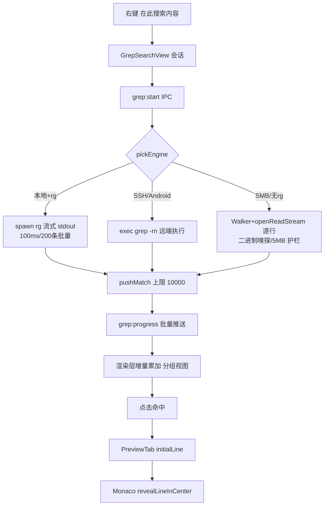

# 内容搜索 + 哈希链（M3） — 架构文档

> 需求来源：`prd/2026-08-15-search-hash-requirements.md`（随总体规划批准）。
> 契约源：`docs/architecture/2026-08-15-search-hash-design-contract.json`（本文档为其人读渲染，两者一致）。

## 零、用户确认记录

- 等级选择：standard（随总体规划批准）。
- 方案版本：`1`。方案确认：规划批准记录（同 M1/M2）；grep 引擎为用户明确选择的「混合引擎」方案。

## 一、模块结构图

```mermaid
flowchart TD
  subgraph View 层
    CD[ChecksumDialog]
    DFV[DuplicateFinderView]
    GSV[GrepSearchView]
    FL[FileList 右键入口]
  end
  subgraph ViewModel 层
    UD[useDuplicates]
    UG[useGrepSearch]
    ULT[useLongTaskProgress（M1 共享）]
  end
  subgraph Infrastructure 层（main）
    CS[ChecksumService]
    DFS[DuplicateFinderService]
    GS[GrepService 引擎矩阵]
  end
  subgraph Domain / 支撑（纯函数+共享基建）
    GP[grepParsing]
    STR[SessionTaskRegistry]
    DW[DirectoryWalker]
    FH[fileHashing / hashAdapterFileRange]
    TPR[ToolPathResolver.hasRipgrep]
  end
  FL --> CD & DFV & GSV
  CD & DFV & GSV --> ULT
  DFV --> UD --> ULT
  GSV --> UG --> ULT
  CS & DFS & GS --> STR & DW & FH & GP
  GS --> TPR
```

依赖方向：View → composable → IPC → Service → 共享基建/纯函数。三个 Service 是同构的「长任务编排器」，仅领域漏斗不同。

## 二、业务流程图（grep 主流程；checksum/dupes 同构）



## 三、角色职责清单

| 角色 | 类型 | 层 | 职责 | 隐藏秘密 | 依赖 | 设计原则 |
|---|---|---|---|---|---|---|
| ChecksumService | class | infra(main) | 逐项哈希（可跨设备）、终态 results+match | 字节进度基线累加 | STR/FH | DRY 复用 |
| DuplicateFinderService | class | infra(main) | 三阶段漏斗编排 | size→4KB→全量的收敛序、5000 组截断、浪费空间降序 | STR/DW/FH | SRP（只编排） |
| GrepService | class | infra(main) | 引擎矩阵选择与执行 | rg 子进程流式解析、远端 grep 构造、流式扫描护栏 | STR/DW/GP/TPR | 策略矩阵 |
| grepParsing | 纯函数 | domain | 输出解析/命令构造/嗅探/行匹配/glob | `:数字:` 边界消歧、`./` 归一 | — | 纯函数可单测 |
| useDuplicates | composable | viewmodel | 会话驱动/终态分组抽取/勾选策略 | 保留最新的勾选算法、可回收计算 | ULT | useDirCompare 配方 |
| useGrepSearch | composable | viewmodel | 会话驱动/增量累加/分组派生 | searching 批次 append、终态冻结 | ULT | 同上 |
| 三视图组件 | view | view | 弹窗/工具页 UI 与交互 | 折叠态、勾选态、命令注册生命周期 | 各 composable | 瞬态页模式 |

## 四、质量属性与方案取舍

| # | 质量属性 | 优先级 | 验收 |
|---|---|---|---|
| QA-1 | 及时反馈 | P0 | grep 批量流式（100ms/200 条）；哈希字节进度 |
| QA-2 | 可取消 | P0 | UI 取消 → 协作标志 + 杀 rg 子进程/销毁流 |
| QA-3 | 引擎自动降级 | P0 | rg 捆绑→$PATH→流式三级；无 rg 不报错 |
| QA-4 | 载荷上限 | P0 | 10000 命中/5000 组/400 字行文本截断 |
| QA-5 | 删除安全 | P0 | dupes 删除走既有 fileOperations 队列 |

候选：ALT-1（选定）三引擎矩阵 + 共享基建复用。ALT-2：全部走流式引擎（统一简单，但本地 node_modules 场景比 rg 慢一个量级，用户已明确选择混合引擎）。ALT-3：全走远端 exec（SMB/WebDAV 无 exec 通道，不可行）。

## 五、设计依据

- 引擎矩阵的判定输入只有「设备类型 + hasRipgrep + exec 存在性」，全部本地可判，无网络探测。
- rg exit code 语义（0/1/2）与 grep 相同处理——exit 1 是零匹配不是错误（实测确认）。
- 远端 `cd root && grep -rn -e pattern .`：输出相对路径由解析层归一，同时规避绝对路径冒号歧义。
- dupes 阶段 2 的 4KB 首块哈希：绝大多数不同内容在「同尺寸+同首块」即分离，避免读全文件（hashAdapterFileRange 读够即毁）。
- `.ts` 误判：PreviewContentRouter 在 initialLine 存在时强制 text（grep 已证明可读）。

## 六、关键接口契约（P0）

### IFC-1 checksum:start/cancel + push（同构三通道，checksum 为例）
- 输入 `ChecksumRequest{sessionId, algo, items[{deviceId,path,name,size}]}`；输出 `{taskId}`；推送 `ChecksumProgress`（终态含 results+match）。
- 不变量：终态必达（绕过节流）；items 逐项顺序执行（单请求在途）。
- 错误：单项失败入 results.error 不中止；全部设备不可达 → failed。

### IFC-2 dupes:start/cancel + push
- 输入 `DuplicateScanRequest{sessionId, deviceId, rootPath, minSize?}`；终态推送 groups（≤5000 + truncated + 浪费空间降序）。
- 不变量：分组键为全量哈希；groups 只在终态携带。

### IFC-3 grep:start/cancel + push
- 输入 `GrepRequest{...pattern/isRegex/caseSensitive/includeGlob/excludeGlob/maxResults?}`；批量推送 `GrepProgress.matches`。
- 不变量：matchCount 单调递增；truncated 只在命中上限后置位；iOS 直接 failed（能力门控）。

### IFC-4 PreviewTab.initialLine（grep→预览跳转）
- openPreview(file, deviceId, initialLine?)；Router 在 initialLine 时强制 text 类型；PreviewTextContent 创建后一次性 reveal+setSelection+focus。

## 七、验证证据

| 命令 | 结果 |
|---|---|
| npm run typecheck | 0 error |
| npx tsc -p tsconfig.node.json | 16 = 基线零新增 |
| npm run build | 通过 |
| npm run test:grep-parse | ✓ 解析/构造/嗅探/glob 全过 |
| npx playwright test grep-results-tab duplicates-tab git-badges command-palette | 12 passed |

## 八、已知缺口 / 未决

- ~~rg 二进制尚未实际投放 build/tools/rg~~ 已投放（2026-08-16）：`scripts/fetch-rg.sh` 自动取最新版（当前 15.2.0，arm64）+ 逐资产 SHA256 校验落位 `build/tools/rg/rg`；ToolPathResolver 候选补 `rg/rg` 并加 isFile 校验（修复目录布局下 spawn 目录的隐患）。开发态仍走 $PATH（`brew install ripgrep`）。
- 远端 BSD grep 的 --exclude 兼容性未验证（Linux 远端为主）。
- grep 命中的 matchStart/End 在 UI 暂未做行内高亮（数据已到位）。
- 跨设备 checksum 对比需 UI 支持跨面板选择（当前单面板 1-2 文件；服务端已支持 per-item deviceId）。
