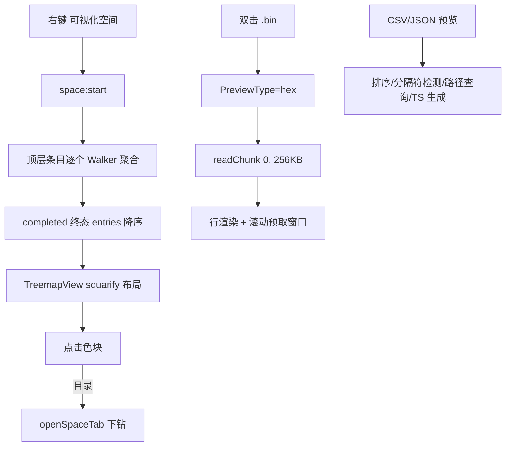

# 空间分析 + 预览增强（M4） — 架构文档

> 需求来源：`prd/2026-08-15-space-preview-requirements.md`（随总体规划批准）。
> 契约源：`docs/architecture/2026-08-15-space-preview-design-contract.json`（本文档为其人读渲染，两者一致）。

## 零、用户确认记录

等级选择 standard（随总体规划批准）；方案版本 1；方案确认同规划批准记录。

## 一、模块结构图

```mermaid
flowchart TD
  subgraph View 层
    TV[TreemapView]
    PHC[PreviewHexContent]
    PTC[PreviewTextContent 增量]
    FL[FileList 右键入口]
  end
  subgraph Domain / 纯函数
    SQ[squarify]
    HF[hexFormat]
    JQ[jsonQuery]
    JT[jsonToTs]
  end
  subgraph Infrastructure 层（main）
    SAS[SpaceAnalyzerService]
    RC[fs:readChunk handler]
  end
  subgraph 共享基建（M1）
    STR & DW & ULT
  end
  FL --> TV
  TV --> SQ & ULT
  TV --> SAS --> DW & STR
  PHC --> HF & RC
  PTC --> JQ & JT
```

## 二、业务流程图



## 三、角色职责清单

| 角色 | 类型 | 层 | 职责 | 隐藏秘密 | 依赖 | 设计原则 |
|---|---|---|---|---|---|---|
| SpaceAnalyzerService | class | infra(main) | 顶层条目聚合 | per-top-child walk、终态 entries 降序 | STR/DW | SRP（不动 DirectoryStatsService 契约） |
| squarify | 纯函数 | domain | squarified 布局 | 剩余总量归一（面积守恒关键）、贪心行 | — | 经典算法 |
| TreemapView | 组件 | view | treemap 渲染/下钻/tooltip | 200 节点+Others、色调=占比×4 钳制、HSL 插值 | ULT/SQ | 瞬态页模式 |
| fs:readChunk | handler | infra(main) | 区间读取 | 本地 fs 区间流/远端前缀丢弃/非流式 32MB 守卫 | adapter | 能力分流 |
| hexFormat | 纯函数 | domain | 16 字节行格式化 | 偏移 8 位 hex、可打印 ASCII 范围 | — | 纯函数 |
| PreviewHexContent | 组件 | view | hex 视图 | 256KB 窗口 LRU(4)、绝对定位行虚拟化 | HF/RC | 只读 |
| jsonQuery/jsonToTs | 纯函数 | domain | 路径查询/TS 生成 | token 状态机；样本合并（optional/并集/嵌套） | — | 纯函数 |
| PreviewTextContent 增量 | 组件片段 | view | CSV 排序/分隔符、JSON 三工具 | 数值感知排序三态；格式化走编辑语义 | JQ/JT | 增量修改（RISK-04） |

## 四、质量属性与方案取舍

| # | 质量属性 | 优先级 | 验收 |
|---|---|---|---|
| QA-1 | 布局正确性 | P0 | 面积守恒/无重叠/确定性（单测） |
| QA-2 | 大文件可行 | P0 | hex 分块 + LRU；treemap 200 节点上限 |
| QA-3 | 分类稳定 | P0 | hex 仅 opt-in 扩展名；unknown 兜底不变 |
| QA-4 | 只读安全 | P0 | 格式化外全只读 |

候选：ALT-1（选定）独立 SpaceAnalyzerService + opt-in hex 扩展名 + 增量修改 PreviewTextContent。ALT-2：扩展 DirectoryStatsService 携带 entries——否决，破坏 FileInfoDialog 既有契约且节流事件装数组会膨胀。ALT-3：unknown 类型全走 hex——否决，误重分类风险。

## 五、设计依据

- squarify 的面积守恒依赖「每行厚度相对剩余值总量与剩余矩形」——初版错用全局总量的教训已固化为单测断言。
- readChunk 本地直用 fs.createReadStream 区间（零冗余）；远端 openReadStream 无区间语义，前缀丢弃是兼容层。
- jsonToTs 的「样本合并」是对象数组形状提取的核心：缺失→optional、多类型→并集、嵌套→独立 interface（RootItem 命名）。
- CSV 数值感知排序：全数字列按数值比较避免 "10" < "9" 的字典序陷阱。

## 六、关键接口契约（P0）

- IFC-1 space:start/cancel + push：输入 `{sessionId, deviceId, rootPath}`；终态 entries 降序（size）。不变量：顶层目录自身计入 directoryCount。
- IFC-2 fs:readChunk：输入 `(deviceId, path, offset, length)` → `{base64, bytesRead, fileSize}`。不变量：offset 越界钳制返回空块；本地零冗余。
- IFC-3 squarify：输入 `{key,value}[] + w,h` → rects。不变量：Σ面积=容器（1e-9 容差）；输入乱序输出同序（内部排序）。
- IFC-4 jsonQuery/jsonToTs：非法输入 ok:false/null，不抛异常；TS 生成对循环引用安全（visiting 表）。

## 七、验证证据

| 命令 | 结果 |
|---|---|
| npm run typecheck / tsc -p tsconfig.node.json | 0 / 16=基线 |
| npm run build | 通过 |
| test:squarify / test:hex-format / test:json-utils | ✓ 全过 |
| playwright treemap-tab + hex-preview + grep-results | 5 passed |

## 八、已知缺口 / 未决

- PreviewTextContent 的 CsvTableView 抽取未做（RISK-04 触发式：当前三处增量已收敛，待下次大改预览时一并抽取）。
- 远端 hex 大偏移滚动的前缀丢弃冗余（openReadStream 无区间）——待适配器扩展区间语义后优化。
- grep 命中行内高亮（matchStart/End）仍未渲染（M3 遗留）。
