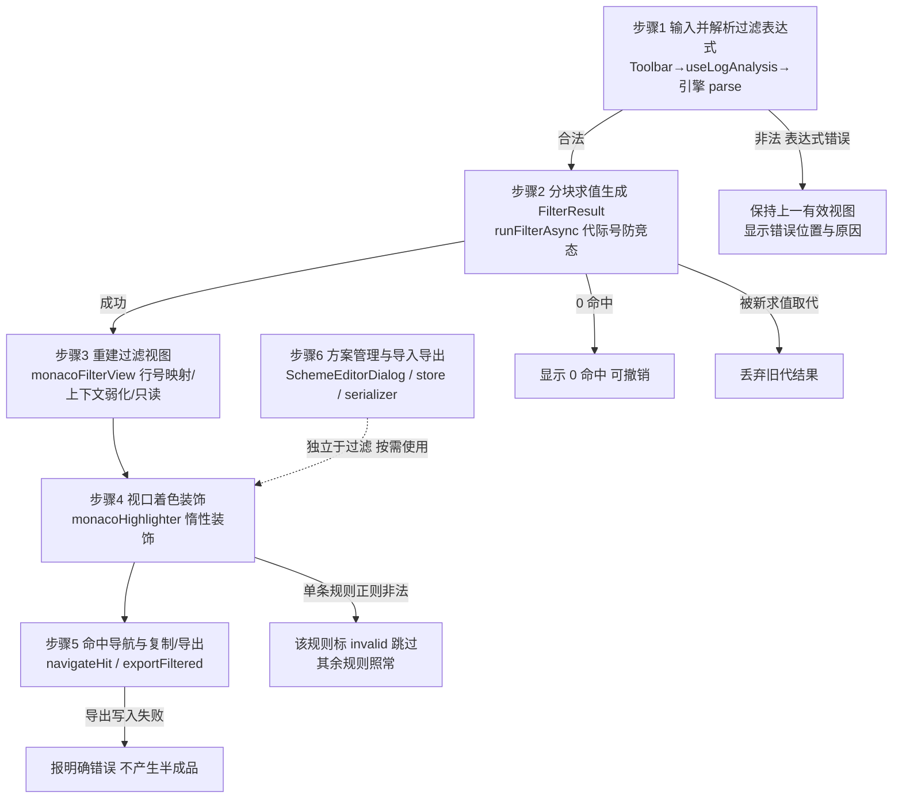

# 文本预览日志排查（表达式过滤 + 着色方案） — 架构文档

> 需求来源：`prd/2026-08-15-text-preview-log-analysis-requirements.md`（已确认）。
> 契约源：`docs/architecture/2026-08-15-text-preview-log-analysis-design-contract.json`（本文档为其人读渲染，两者一致）。

## 零、用户确认记录

- 等级选择：用户在等级选择门展示后回复选择 `standard`。
- 当前方案版本：`1`（proposal_revision）。
- 方案确认：用户在完整方案展示（质量属性 / 三候选 / 10 角色 / 5 接口 / 验证策略）后的后续消息中回复「ALT-1 进入编码」，确认 `ALT-1`。

## 一、模块结构图

```mermaid
flowchart TD
  subgraph View 层
    HOST[PreviewTextContent.vue<br/>宿主集成 view]
    TB[LogAnalysisToolbar<br/>view]
    DLG[SchemeEditorDialog<br/>view]
  end
  subgraph ViewModel / Store 层
    VM[useLogAnalysis<br/>view_model]
    ST[logAnalysis store<br/>store + localStorage]
  end
  subgraph Infrastructure 层（Monaco 适配器）
    FV[monacoFilterView<br/>infrastructure]
    HL[monacoHighlighter<br/>infrastructure]
  end
  subgraph Domain 层（纯 TS）
    D1[textFilter 引擎<br/>domain_service]
    D2[filterPipeline<br/>domain_service]
    D3[schemeModel<br/>aggregate]
    D4[schemeSerializer<br/>domain_service]
  end

  HOST --> VM
  TB --> VM
  TB --> ST
  DLG --> ST
  VM --> D1
  VM --> D2
  VM --> ST
  VM --> FV
  VM --> HL
  ST --> D3
  DLG --> D3
  DLG --> D4
  D2 --> D1
  HL --> D3
  FV --> D2
```

依赖方向单向且指向稳定方：Domain 层（utils）不依赖任何 Vue/Pinia/Monaco；Store 只依赖 domain 模型；ViewModel 编排 domain + store + 两个 Monaco 适配器；View 只消费 ViewModel 与 Store。`FV --> D2` 是类型依赖（FilterResult），不产生反向控制。

## 二、业务流程图



六个步骤与契约 `business_process[]` 一一对应：业务流程图-步骤1、业务流程图-步骤2、业务流程图-步骤3、业务流程图-步骤4、业务流程图-步骤5、业务流程图-步骤6。

## 三、角色职责清单

| 角色 | 类型 | 层 | 职责 | 隐藏秘密 | 数据所有权 | 依赖 | 设计原则 |
|---|---|---|---|---|---|---|---|
| textFilter 表达式引擎（扩展） | 领域 | domain | 词法→语法→求值；新增 level()/lines()，match 扩为 match(text, ctx?) | 谓词语法与求值策略 | 无状态（每次 ComposeExpression 新建编译闭包） | — | domain_service、SRP、OCP |
| 过滤管线 filterPipeline | 领域 | domain | 原文行+表达式+选项 → FilterResult（可见条目/命中数/命中行号），分块让出 | 上下文合并去重、反向、分块调度 | 无状态 | 引擎 | domain_service、SRP、minimize_complexity |
| 着色方案模型 schemeModel | 领域 | domain | 方案/规则类型、内置预设、规则校验、优先级叠加 | 方案数据形态与叠加算法 | 无持久状态（纯定义+预设常量） | — | aggregate、value_object、SRP |
| 方案序列化 schemeSerializer | 领域 | domain | 方案↔JSON 文件（版本号、校验、重名策略） | 导入导出文件格式 | 无状态 | schemeModel | domain_service、information_hiding |
| logAnalysis store | 分层 | store | 自定义方案库、生效方案、级别词表、历史/收藏的持久化 | 持久化键名与去重/上限策略 | 全局方案库+历史（localStorage） | schemeModel | SRP、separation_of_concerns |
| useLogAnalysis | 分层 | view_model | 每 tab 过滤会话状态与编排（含代际竞态防护） | 会话状态机与编排逻辑 | 当前预览 tab 会话状态（不持久化） | 引擎、管线、store、两个适配器 | SRP、DIP、separation_of_concerns |
| 日志分析工具栏与宿主集成 | 分层 | view | 表达式输入/计数/开关/方案切换/导出按钮；宿主交接编辑器 | 工具栏交互布局与局部 UI 状态 | 组件局部 UI 状态 | useLogAnalysis、store、对话框 | SRP、ISP |
| Monaco 过滤视图适配器 monacoFilterView | 分层 | infrastructure | 由 FilterResult 重建内容、行号映射、上下文弱化、只读、导航定位 | Monaco 视图重建细节 | 装饰句柄与行号映射（随编辑器销毁） | — | DIP、information_hiding |
| Monaco 着色渲染器 monacoHighlighter | 分层 | infrastructure | 视口+缓冲区惰性计算规则命中并增量应用装饰 | 装饰应用与视口惰性策略 | 已装饰行缓存（有上限） | schemeModel | DIP、high_cohesion_low_coupling |
| 方案编辑对话框 SchemeEditorDialog | 分层 | view | 规则 CRUD/排序/颜色、导入导出、内置方案复制 | 编辑表单交互 | 表单草稿（确认前不落库） | store、schemeModel、serializer | SRP、separation_of_concerns |

## 四、质量属性与方案取舍

| 质量属性 | 优先级 | 场景 | 验收 |
|---|---|---|---|
| large_file_latency | high | 100MB/百万行日志按 Enter 执行 `co(error) and not co(timeout)` | 分块求值且块间让出主线程；输入过程不重扫；秒级出结果 |
| line_fidelity | high | 过滤/上下文/反向任意组合 | 显示行号恒等于原始行号；导出与原始行一一对应 |
| readonly_safety | high | 过滤激活时尝试编辑并 Cmd+S | 过滤视图强制只读；导出仅写 `<原名>.filtered.log` 新文件 |
| theme_compatibility | high | dark/light 任一主题使用任意方案 | 规则颜色走 `[data-theme]` CSS 变量；非颜色信号并存 |
| expression_feedback | medium | 非法表达式 / 单条规则正则非法 | 解析失败报位置并保持旧视图；规则级非法只禁用该规则 |
| scheme_portability | medium | 方案跨机器导出/导入 | 格式含版本号；非法文件报错无半成品；重名加后缀 |

**候选方案**：

- **ALT-1（已选）**：纯函数管线 + composable ViewModel + Monaco 适配器。优点：管线与方案模型可脱离 DOM/Monaco 独立断言；宿主组件不再膨胀；过滤与着色两个变化方向隔离。代价：新增约 10 个文件；适配器须遵守 Monaco 接入规约。
- **ALT-2**：store 集中式 + 内联渲染。优点：文件少。缺点：1300+ 行宿主组件再增 600+ 行（SRP 失守）；纯逻辑与 Monaco 耦合不可独立验证；单 tab 会话状态入全局 store 需手工清理。
- **ALT-3**：ALT-1 + Web Worker 求值。优点：百万行正则完全不让出主线程。缺点：违反 YAGNI（PRD 仅要求防抖+秒级）；electron-vite worker 有专门坑。

**选择理由**：QA-1/2/5 依赖可独立验证的纯管线（ALT-2 做不到）；QA-4/6 依赖方案模型与渲染解耦；ALT-3 复杂度超出性能承诺，登记为性能退化时的演进方向。

**自顶向下检查**：用户流程＝输入→解析→分块求值→视图重建→视口着色→计数/导航/导出，每步唯一所有者（解析=引擎、求值=管线、重建=过滤适配器、着色=渲染器、编排=ViewModel、方案库=store）。
**自底向上检查**：谓词注册表支持增量注册；`match(text, ctx?)` 对旧调用方零回归（仅 PreviewTextContent 一个消费方，已实测）；Monaco `lineNumbers` 回调与装饰集合为 0.44 稳定 API；导出复用既有 `writeFile`，不改三处 IPC 契约；远程内容经 `readFile` 已在 renderer，管线与设备来源无关。
**风险 spike**：无（standard 级未发现需要编码前验证的高风险假设；大文件手感列入 unverified 跟踪）。
**评审**：用户在方案展示后确认 ALT-1（review.mode=user）。

## 五、设计依据

### textFilter 表达式引擎（扩展）ROLE-D01
- 划分理由：谓词语法与求值策略是独立变化的轴，沿用引擎既有 lexer/parser/evaluator/predicates 分层，新谓词只进注册表与解析层校验，不改旧谓词。
- 依据原则：OCP（注册表增量扩展）、SRP（只做表达式解析与求值）、domain_service（无状态领域计算）。
- 业界来源：DDD 领域服务；解释器模式的谓词注册表。

### 过滤管线 filterPipeline ROLE-D02
- 划分理由：跨行组合计算（上下文合并、反向、计数）不属于任何实体也不属于视图，抽为纯领域服务后可脱离 Monaco 单测。
- 依据原则：domain_service；SRP；minimize_complexity（sync/async 共享同一 assembleResult 尾部）。
- 业界来源：DDD 领域服务；grep -C 的上下文行语义。

### 着色方案模型 schemeModel ROLE-D03
- 划分理由：方案是一致性边界（规则顺序即优先级、invalid 规则跳过），规则是不可变值对象；颜色以 colorKey 表达并映射到主题 CSS 类，保证双主题可读。
- 依据原则：aggregate（方案为聚合根）；value_object（规则）；SRP。
- 业界来源：DDD 聚合根/值对象；klogg 高亮规则集形态。

### 方案序列化 schemeSerializer ROLE-D04
- 划分理由：导入导出文件格式是独立变化点（版本演进、校验规则），隔离后格式变化不波及模型与 UI。
- 依据原则：information_hiding；domain_service。
- 业界来源：DDD 领域服务；带版本头的配置文件序列化惯例。

### logAnalysis store ROLE-L01
- 划分理由：跨组件共享的持久状态（方案库/词表/历史）与每 tab 会话状态分离；持久化细节（键名、去重、上限）集中一处。
- 依据原则：SRP；separation_of_concerns。
- 业界来源：Pinia setup store 惯例（仓库先例 fileBrowser.searchHistory）。

### useLogAnalysis ROLE-L02
- 划分理由：异步分块求值、代际竞态防护、多状态组合（表达式/反向/上下文/方案/计数）与两个适配器的编排值得独立于模板单测与演进；View 因此保持渲染与意图转发。
- 依据原则：SRP；DIP（编排适配器接口而非具体 DOM 操作）；separation_of_concerns。
- 业界来源：MVVM Presentation Model（Vue composable-as-ViewModel，仓库先例 useDirCompare）。

### 日志分析工具栏与宿主集成 ROLE-L03
- 划分理由：交互呈现与状态编排分离；宿主 PreviewTextContent 只做编辑器生命周期与集成点（创建/销毁/滚动通知/保存守卫）。
- 依据原则：SRP；ISP（props 精简为单一 vm 对象 + 事件）。
- 业界来源：smart-dumb 组件单向数据流。

### Monaco 过滤视图适配器 monacoFilterView ROLE-L04
- 划分理由：过滤视图重建涉及大量 Monaco 细节（内容注入、行号回调、只读切换、装饰），隔离后管线与 ViewModel 不接触第三方 API；编辑器实例重建时自动重绑。
- 依据原则：DIP；information_hiding。
- 业界来源：端口适配器（隔离第三方 API）。

### Monaco 着色渲染器 monacoHighlighter ROLE-L05
- 划分理由：视口惰性装饰是与过滤视图不同的性能技巧与变化轴（缓冲大小、装饰回收、滚动去抖），独立成角色后互不牵连。
- 依据原则：DIP；high_cohesion_low_coupling。
- 业界来源：端口适配器 + 虚拟化视口渲染。

### 方案编辑对话框 SchemeEditorDialog ROLE-L06
- 划分理由：规则 CRUD 表单是短生命周期草稿态（确认前不落库），独立组件避免工具栏膨胀。
- 依据原则：SRP；separation_of_concerns。
- 业界来源：草稿-确认两段式对话框惯例。

### UI 架构决策
- 框架：Vue 3 + Electron renderer；现状模式：Direct View + Redux/Store；目标模式：MVVM + Redux/Store。
- 状态所有者：logAnalysis store 拥有全局方案库/词表/历史（localStorage）；useLogAnalysis 拥有当前 tab 会话状态与编排；UI 组件仅持短生命周期交互状态；Monaco 实例仍归宿主所有。
- MVVM 适用性：already_used（仓库已有 composable-as-ViewModel 先例）；view_model_policy=required；迁移影响 low，迁移确认 not_required——沿用既有模式而非新引入。

## 六、关键接口契约（P0）

### IFC-1 ComposeExpression.match(text, ctx?) 扩展
- Provider：引擎（D01）；Consumers：管线（D02）、ViewModel（L02）。
- 输入：`text: string`；`ctx?: { lineNumber: number }`（1-based 原始行号）。输出：boolean。
- 前置：`lines()` 必须带 ctx 才可求值；`level()` 仅需 text。后置：不传 ctx 时既有谓词语义逐字节不变。
- 不变量：既有调用方零回归（仓库内唯一消费方 PreviewTextContent 已由断言覆盖）；`lines()` 值语法非法在 parse 阶段报错。
- 错误：reg/REG 正则非法上浮为解析错误（含位置）；lines 缺 ctx 时求值为 false。
- 数据所有权：编译闭包归 ComposeExpression 实例；并发：纯函数式求值无共享可变状态；事务：not_applicable。

### IFC-2 filterPipeline.runFilter / runFilterAsync
- Provider：管线（D02）；Consumer：ViewModel（L02）。
- 输入：`{ lines, expr, options: { invert, contextBefore, contextAfter } }`；输出：`FilterResult { entries, matchCount, matchSourceLines }`（async 取消时返回 null）。
- 前置：expr 已通过 isValid()。后置：entries 按 sourceLine 升序无重复；matchCount=match 条目数；上下文为 0 时无 context 条目；invert 时 kind 语义对调。
- 不变量：同一行不因被多个匹配行共享上下文而重复。
- 错误：0 命中为合法结果（视图显示 0 命中）。
- 数据所有权：FilterResult 归调用方。并发：分块求值块间让出；调用方代际号使旧代结果作废。事务：not_applicable。

### IFC-3 schemeModel 叠加解析（compileScheme / matchLine）
- Provider：方案模型（D03）；Consumers：渲染器（L05）、对话框（L06）。
- 输入：HighlightScheme + 单行文本；输出：整行类名（首个命中行规则）+ 片段区间列表。
- 不变量：规则顺序即优先级；片段先到先得不叠加；整行与片段可共存；单条规则非法只跳过该规则。
- 数据所有权：方案对象不可变（值对象语义），修改走 store 整体替换。并发/事务：not_applicable。

### IFC-4 monacoHighlighter.setCompiledScheme / scheduleRefresh 视口着色
- Provider：渲染器（L05）；Consumer：ViewModel（L02）。
- 输入：编辑器实例（惰性访问）+ 生效方案 + 可视范围（内部取 getVisibleRanges±150 行）。
- 后置：视口内行装饰与方案一致；已滚出缓冲区的装饰可回收（上限 3000 行）；滚动增量补齐不整表重算；无方案/无编辑器为无操作。
- 错误：装饰异常捕获并 console.error 带上下文。
- 数据所有权：装饰集合与已装饰行缓存归渲染器，dispose 清理；并发：rAF 去抖串行调用。

### IFC-5 导出过滤结果 exportFiltered
- Provider：ViewModel（L02）；Consumer：工具栏（L03）。
- 输入：源文件 { deviceId, path } + 当前 FilterResult；输出：导出路径。
- 前置：结果非空且设备可写。后置：新文件为 `<原路径>.filtered.log`（已存在则 `.filtered.2.log` …），内容为「原始行号 + 空格 + 原文」。
- 不变量：绝不写回源文件。
- 错误：writeFile 失败报明确错误；并发：导出期间按钮锁定防重复。

## 七、验证证据

| 命令 | 结果 | 证据 |
|---|---|---|
| `npm run test:log-analysis` | 通过 | 2026-08-15 exit 0：23 项断言全部通过（新增最小 esbuild+node 断言 harness，不引入测试框架） |
| `npm run typecheck` | 通过 | 2026-08-15 exit 0：vue-tsc --noEmit 无诊断 |
| `npm run build` | 通过 | 2026-08-15 exit 0：main/preload/renderer bundle 完成 |
| `git diff --check` | 通过 | 2026-08-15 exit 0：无空白错误 |

关键检查映射：

| 目标 | 方式 | 证据 |
|---|---|---|
| IFC-1 引擎扩展零回归 + level/lines 语义 | new_test | tests/logAnalysis.test.ts：词表/未知级别回退/自定义词表、ctx 有无、lines 与 reg 非法值 parse 期报错、7 项旧谓词兼容断言 |
| IFC-2 管线不变量 | new_test | 行号保真、上下文合并去重、反向计数互补、0 命中合法、取消返回 null、async=sync |
| IFC-3 方案叠加语义 | new_test | 首个行规则生效、片段先到先得不重叠、单规则非法跳过、内置预设干净编译、行+片段共存 |
| QA-6 序列化 | new_test | 往返保序、四类非法载荷拒绝、防重名 |
| QA-1 分块让出 | static_check | runFilterAsync 按 20000 行分块、块间 setTimeout(0)；仅 Enter 求值 |
| QA-2/QA-3 只读安全与行号保真 | static_check | 过滤视图 readOnly + lineNumbers 回调 + isModified 抑制 + saveFile 双重守卫 + 导出 exists 防覆盖 |
| QA-4 双主题 | static_check | style.css `--fma-*` 调色板双主题定义，装饰类全部引用 CSS 变量 |

## 八、已知缺口 / 未决

- 问题：100MB 级真实日志的过滤耗时、滚动流畅度与内存手感未实测。影响：QA-1 最终确认依赖真实数据体感。后续阶段：`npm run dev` 用真实大日志冒烟；不达标时按契约登记的 ALT-3（Worker 求值）演进。
- 问题：Monaco 装饰器快速滚动时的视觉稳定性与两主题对比度未人眼确认。影响：视口惰性装饰策略的结构正确性已保证，视觉效果待验。后续阶段：开发环境人工冒烟。
- 问题：远程设备（SMB/SSH/Android/iOS）日志文件的过滤与导出未真机验证。影响：链路与本地一致（readFile 已在 renderer），但真机时序未验。后续阶段：连接真实设备验证。
- 问题：过滤历史条数上限与清理策略（PRD 未决）。影响：历史下拉可用性。后续阶段：当前实现为 50 条上限 + 手动清空，如需调整在交互层面修改 store 常量即可。
- 问题：导出目前固定写源文件同目录，无系统保存对话框。影响：用户无法另存任意路径。后续阶段：如反馈需要，另立 feature 增加 `system:saveDialog` IPC（涉及三处契约同步）。
