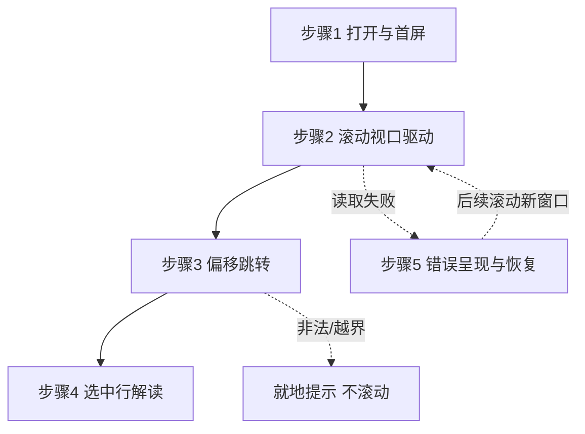

# Hex 查看器成熟基线升级（全文件虚拟滚动 + 偏移跳转 + Data Inspector） — 架构文档

> 需求来源：用户对话（成熟产品基线对齐，2026-08-16）。
> 契约源：`docs/architecture/2026-08-16-hex-viewer-baseline-design-contract.json`（本文档为其人读渲染，两者一致）。

## 零、用户确认记录

- 等级选择：用户在等级选择门回复选择 `standard`（2026-08-16）。
- 当前方案版本：`1`（proposal_revision）。
- 方案确认：确认来自后续消息——完整方案（质量属性 / 双候选 / 5 角色 / 4 接口 / 5 流程 / 验证策略）展示后，用户回复「确认，按 ALT-1 编码」。

## 一、模块结构图

```mermaid
flowchart TD
  subgraph View 层
    V[PreviewHexContent.vue<br/>行渲染/跳转框/Inspector 面板]
  end
  subgraph ViewModel 层
    VM[useHexViewer<br/>视口/光标/错误状态 + 编排]
  end
  subgraph Domain 层（纯函数）
    VP[hexViewport<br/>坐标换算唯一来源]
    HF[hexFormat<br/>行格式化/偏移解析/字节解读]
  end
  subgraph Infrastructure 层
    WC[HexWindowCache<br/>64KB 窗口 LRU + 在途合并]
    RC[fs:readChunk 通道<br/>（既有，本 feature 未改）]
  end
  V -->|onScroll/jumpTo/selectRow| VM
  VM -->|rows/inspector/pendingScrollRow| V
  VM --> VP
  VM --> HF
  VM --> WC --> RC
```

依赖方向声明：`view → view_model → infrastructure / domain`，单向无环；View 不直接依赖缓存与坐标函数（DC-1/DC-3）。

## 二、业务流程图



- 步骤1：mount → `cache.get(0)` → 首屏行集。异常：readChunk 失败 → error 状态。
- 步骤2：scroll → rAF 合帧 → `visibleRowRange` → 行集（窗口未命中行 `loaded=false` 占位）→ 可视首/末行窗口 `get`（在途合并）→ 落定 `revision++` 行集刷新。
- 步骤3：输入 → `parseOffsetInput`（0x/纯hex含字母/十进制）→ 钳制 → 确保窗口 → `pendingScrollRow` → View 滚动居中 → ring 高亮。异常：非法输入就地报错；越界钳至 size-1 并提示。
- 步骤4：点行 → cursorRow → `interpretAt`（窗口内行首偏移）→ Inspector 条目。异常：字节不足类型宽度跳过。
- 步骤5：错误条呈现 + 已加载区保留，滚动重试自然恢复。

## 三、角色职责清单

| 角色 | ID | 类型 | 层 | 职责 | 隐藏秘密 | 数据所有权 | 依赖 | 业界依据 / 原则 |
|---|---|---|---|---|---|---|---|---|
| PreviewHexContent | ROLE-L01 | 分层 | view | 渲染行/跳转框/Inspector，转发意图 | DOM 结构与样式 | 无（全部来自 VM） | ROLE-L02 | Vue 页面组件惯例 / SRP、separation_of_concerns |
| useHexViewer | ROLE-L02 | 分层 | view_model | 会话状态 + 编排取窗/滚动/跳转/解读 | 视口↔窗口协调、overscan/rAF、高亮时序 | 会话 ref + cache 实例 | ROLE-L03, ROLE-D01, ROLE-D02 | MVVM Presentation Model（composable 配方）/ SRP、DIP |
| HexWindowCache | ROLE-L03 | 分层 | infrastructure | 64KB 窗口取数/解码/LRU/在途合并 | 窗口大小/容量/对齐/去重 | 窗口 Map + 在途 Map | [] | Repository/端口适配器（fetcher 注入）/ information_hiding、DIP、defensive_design |
| hexViewport | ROLE-D01 | 领域 | domain（值对象） | 坐标唯一换算 | 坐标系定义（16B×22px）与钳制 | 无 | ROLE-D02 | DDD 值对象（纯函数集）/ value_object、SRP、defensive_design |
| hexFormat | ROLE-D02 | 领域 | domain（值对象） | 行格式化 + 偏移解析 + 字节解读 | 解析启发式、DataView 语义映射 | 无 | [] | DDD 值对象（纯函数）/ value_object、SRP |

角色二分说明：分层角色 3 + 领域角色（值对象形态）2；本 feature 为纯前端展示型，无聚合/实体/事件，领域以不可变纯函数承载。

## 四、质量属性与方案取舍

| # | 质量属性 | 优先级 | 场景 / 验收 |
|---|---|---|---|
| QA-1 | 规模可扩展 | high | 1GB 拖滚动条任意位置 2s 内可见；DOM 行 ≤ ~120 与文件大小无关 |
| QA-2 | 坐标不变量 | high | row≡⌊offset/16⌋、top≡row×22 唯一经 hexViewport；输出全钳制 |
| QA-3 | 跳转正确 | high | 0x1A2B/6667/1A2B 可解析；越界钳制；非法就地报错 |
| QA-4 | 解读正确 | high | 与 DataView 逐位一致；不足宽度跳过 |
| QA-5 | 健壮 | medium | 同窗在途合并；失败不留半成品、已加载区保留 |
| QA-6 | 约束 | high | 零新依赖；CSS 变量；纯函数单测 |

候选与选择：
- **ALT-1（选定）** 视口驱动 + 绝对定位自管可视行集。优点：现有 `top=行号×行高` 定位天然 O(可视)；滚动数学可纯函数单测（正是 QA-2 载体）；适配「行数天文、数据稀疏」。代价/风险：自写视口换算（以单测补偿）；滚动风暴（在途合并 + rAF 合帧缓解）。
- **ALT-2（否决）** RecycleScroller items=全部行号。vue-virtual-scroller 需实体 items 数组——1GB ≈ 6700 万占位对象，构建即 O(n) 内存/时间，`scrollToItem` 退化。库能力边界否决（Hex Fiend 等成熟工具自绘滚动区即此因）。

自顶向下：流程（打开→滚动→跳转→解读）与 QA 推导出五角色各一责；自底向上：既有绝对定位渲染与 readChunk 通道可复用，库约束排除 ALT-2。

## 五、设计依据

- **ROLE-L01 PreviewHexContent**：View 只渲染与转发意图（SRP）——重构前组件混合状态/数学/渲染，本 feature 将其拆薄为纯 View（Vue 页面组件惯例，单向数据流）。
- **ROLE-L02 useHexViewer**：异步分块加载、多状态组合与跳转/选行意图值得独立单测（MVVM Presentation Model，composable-as-VM 为仓库既有配方 useGrepSearch 同款；DIP——依赖注入的缓存与纯函数可替换）。
- **ROLE-L03 HexWindowCache**：窗口大小/LRU/在途合并是易变实现细节，独立类 + fetcher 构造注入隐藏之（information_hiding；Repository/端口适配器，内存 fetcher 即可单测）。
- **ROLE-D01 hexViewport**：滚动、跳转、行渲染三处共享同一坐标换算，第二套公式是不变量破坏的头号来源 → 独立纯函数值对象 + 恒等断言（value_object、SRP）。
- **ROLE-D02 hexFormat**：解析启发式与 DataView 语义映射自成一体且必须无副作用可单测（value_object、SRP），与既有行格式化同文件一脉相承。
- **坐标唯一来源**：滚动、跳转、行渲染三处共享同一换算，第二套坐标公式是不变量破坏的头号来源 → hexViewport 独立纯函数 + 恒等断言（DC-3）。
- **窗口 64KB/容量 4**：视口 ~23 行×16B=368B，64KB 覆盖 4096 行预取余量充足；4 窗=256KB 内存上限；对齐边界使 `peek` 同步渲染无需 Promise。
- **在途合并**：滚动高频触发同一窗口 get，Map<start,Promise> 去重避免请求风暴；失败清在途表使重试真实重发（测试断言两次 fetch）。
- **VM 不触 DOM**：跳转产生 `pendingScrollRow` 状态，滚动动作由 View 执行（MVVM 边界；可测性：VM 无 DOM 依赖）。
- **解读用 DataView**：符号/端序/浮点语义逐位复用平台实现，测试以 Node DataView 对照而非手算魔数。

## 六、关键接口契约（P0）

### IFC-1 HexWindowCache.get / has（provider L03 → consumer L02）
- 输入 `get(offset)`（内部对齐 64KB 边界）/ `has(offset)` 同步探测。
- 前置 offset < fileSize；后置返回含该 offset 整窗，长度 min(64KB, size-alignedStart)。
- 不变量：同窗在途共享 Promise；LRU 4 驱逐最旧；失败清在途不留半成品、错误含窗口起点。
- 并发：同窗合并、异窗并行；无取消（窗口小收益低）。

### IFC-2 useHexViewer 会话 API（provider L02 → consumer L01）
- 输入：`onScroll(scrollTop, viewportHeight)` / `jumpTo(text)` / `selectRow(row)`。
- 输出：rows（可视±overscan 行集，未加载行占位）、inspector、error、jumpNotice、pendingScrollRow 等。
- 不变量：行集仅由 visibleRowRange 派生；坐标换算全委托 hexViewport；滚动 rAF 合帧。

### IFC-3 hexViewport 坐标换算（provider D01 → consumer L02）
- `visibleRowRange/rowToOffset/offsetToRow/rowTop/clampOffset/scrollTopToCenter`。
- 不变量：row≡⌊offset/16⌋、top≡row×22；输出钳 [0,totalRows)；非法输入收敛不抛异常。

### IFC-4 hexFormat.parseOffsetInput / interpretAt（provider D02 → consumer L02）
- `parseOffsetInput(text, size)`：0x 前缀/纯 hex 含字母/十进制；越界钳 size-1 置 clamped；非法 `{ok:false}` 不抛异常。
- `interpretAt(bytes, offset)`：int8/uint8、16/32/64 与 float32/64 × LE/BE；不足宽度跳过；DataView 逐位一致。

## 七、验证证据

| 命令 | 结果 | 证据 |
|---|---|---|
| `npm run typecheck` | 通过 | vue-tsc 0 error |
| `npm run test:hex-viewport` | ✓ | row↔offset↔top 恒等、钳制、区间覆盖/缓冲有界（<100 行）、跳转居中 |
| `npm run test:hex-window-cache` | ✓ | 对齐、在途合并（慢 fetcher 单次调用）、LRU 驱逐序、失败重试重发起、尾窗截尾 2148B |
| `npm run test:hex-format` | ✓ | parseOffsetInput 三态+越界+非法；interpretAt DataView 对照、1/2/4 字节部分宽度、float64 精确值 |
| `npx playwright test e2e/hex-preview.spec.ts` | 6 passed | 既有 2 回归 + 滚动高 1,441,792px（无 5000 封顶）且 DOM 行 <120 + 跳转 ring 高亮/非法提示 + 越界钳 0x1f + Inspector int8/uint8/float64 |
| `npm run build` | 通过 | 三端产物 |
| 邻域回归 `e2e/copy-path.spec.ts` | 4 passed | 共享组件无回归 |

## 八、已知缺口 / 未决

- 真实 1GB 文件手感（滚动/预取节奏）未实测——mock 1MB 已证逻辑，真实 IO 属用户验收（unverified）。
- 远端 readChunk 无区间语义（前缀丢弃），大偏移滚动首帧等待较长——待适配器区间扩展。
- 行宽切换（8/16/32 B/行）与字节搜索未纳入（open_questions，常量已集中便于扩展）。
