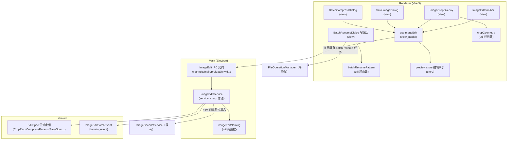

# 图片预览编辑强化（裁剪/压缩/批量） 架构文档

> 栈说明：枚举无 Electron 项，按最接近的全栈形态 `FastAPI+Vue` 记录；后端实为 Electron main 进程 Node/TS 服务层，前端为 Vue 3 + Pinia。

## 零、用户确认记录

- 等级选择：用户在等级门回复中明确选择 `standard`。
- 当前方案版本：`1`。
- 方案确认：用户在完整方案（含质量属性、ALT-1/ALT-2 候选比较、14 角色、7 接口契约、12 步流程、验证策略）展示后的后续消息中回复「按此方案（ALT-2 + 上述角色与契约）进入编码」，确认 `ALT-2`。
- UI 迁移确认：`migration_impact=low`（全为新文件 + 局部接线），`migration_confirmation=not_required`。

## 一、模块结构图

依赖方向：view → view_model → IPC → service → util/值对象；service 不 import renderer（DC-1）。

## 二、业务流程图

```mermaid
flowchart TD
    s1[步骤1 预览tab展示编辑工具条] --> s2[步骤2 进入裁剪模式拖选]
    s2 --> s3[步骤3 调整压缩参数+试编码预估]
    s3 --> s4[步骤4 确认保存策略]
    s2 --> s4
    s4 --> s5[步骤5 执行编辑并原子落盘]
    s5 --> s6[步骤6 会话刷新 size/path]
    s1 --> s7[步骤7 集合tab发起批量压缩]
    s7 --> s8[步骤8 批量顺序执行+进度推送]
    s8 --> s9[步骤9 完成后刷新目录与会话]
    s1 --> s10[步骤10 集合tab发起批量改名]
    s10 --> s11[步骤11 既有batch-rename任务队列]
    s11 --> s12[步骤12 改名后同步会话列表]
    s2 -.->|Esc 取消 零副作用| s1
    s3 -.->|预估失败 显示无法预估| s4
    s5 -.->|失败 原文件不变+行内提示| s4
    s8 -.->|单张失败记录继续 / 取消保留已完成| s9
    s10 -.->|重名冲突 禁用提交| s10
```

> 上图节点与契约 business_process 一一对应：业务流程图-步骤1、业务流程图-步骤2、业务流程图-步骤3、业务流程图-步骤4、业务流程图-步骤5、业务流程图-步骤6、业务流程图-步骤7、业务流程图-步骤8、业务流程图-步骤9、业务流程图-步骤10、业务流程图-步骤11、业务流程图-步骤12。

## 三、角色职责清单

| 角色 | 类型/层 | 职责 | 隐藏秘密 | 数据所有权 | 依赖 | 设计原则 | ID |
|---|---|---|---|---|---|---|
| ImageEditService | layer/service | sharp 管道、原子落盘、批量循环+进度 | 图像库/格式能力/原子写细节 | 无持久状态（任务态在 Registry） | L02,L03,D01,D02 | SRP, information_hiding, OCP | ROLE-L01 |
| ImageEdit IPC 契约 | layer/infrastructure | image:edit* 通道三处同步 | IPC 协议形状 | 无 | L01 | separation_of_concerns | ROLE-L02 |
| imageEditNaming | layer/util | 输出路径：后缀/冲突递增/扩展名 | 命名与去重策略 | 无状态（exists 注入） | D01 | SRP, defensive_design | ROLE-L03 |
| ImageEditToolbar | layer/view | 浮动工具条入口与可用性展示 | 无 | 无 | L05 | SRP, ISP | ROLE-L04 |
| useImageEdit | layer/view_model | 编辑会话状态机/节流预估/apply 编排/批量订阅 | 编辑交互流程与异步编排 | feature-scoped 会话状态 | L02,L06,L07,L08,L09,L12,D01 | SRP, DIP, separation_of_concerns | ROLE-L05 |
| ImageCropOverlay | layer/view | 裁剪遮罩/拖拽/手柄/比例锁 | 拖拽交互细节 | 拖拽瞬时状态 | L07 | SRP, ISP | ROLE-L06 |
| cropGeometry | layer/util | 显示↔源像素映射/clamp/比例锁 | fit 与缩放的几何反算 | 无状态纯函数 | D01 | SRP, defensive_design | ROLE-L07 |
| SaveImageDialog | layer/view | 覆盖/另存+格式质量+预估展示 | 无 | 表单临时态 | D01 | SRP | ROLE-L08 |
| BatchCompressDialog | layer/view | 批量参数+应用到全部 N+进度 | 无 | 表单临时态 | D01,L05 | SRP | ROLE-L09 |
| BatchRenameDialog（增强） | layer/view | 前缀+序号+查找替换+预览+冲突禁提交 | 无 | 表单临时态 | L11 | SRP, OCP | ROLE-L10 |
| batchRenamePattern | layer/util | 规则→renameItems 映射+冲突检测 | 改名规则公式 | 无状态纯函数 | 无 | SRP, defensive_design | ROLE-L11 |
| preview store 编辑同步 | layer/store | 保存后刷新 file、改名后映射 files/index | 会话与磁盘一致性时机 | 复用 PreviewTab 会话 | D01 | SRP, tell_dont_ask | ROLE-L12 |
| EditSpec 值对象组 | domain/value_object | 不可变编辑参数与结果 | 参数规范形状 | 无状态（类型契约） | 无 | value_object, separation_of_concerns | ROLE-D01 |
| ImageEditBatchEvent | domain/domain_event | 批量执行事实事件（进度/终态） | 可观测事件形状 | 无 | D01 | domain_event | ROLE-D02 |

角色二分说明：分层角色 12 + 领域角色 2（值对象、领域事件）；**不设聚合根/实体**——单次编辑是无状态变换、无跨对象一致性规则，硬造聚合反而增加复杂度（minimize_complexity）。

## 四、质量属性与方案取舍

| 属性 | 优先级 | 场景 → 验收 |
|---|---|---|
| data_safety | high | 覆盖保存中途失败 → 原文件字节不变（temp+rename）；copy 冲突 -1 递增 |
| observability | high | 批量逐项进度+终态（成功/失败+原因） |
| cancellability | medium | 取消=当前项完成即停，已完成保留 |
| latency_feedback | medium | 参数变化 ≤1s 预估（300ms 节流试编码） |
| maintainability | medium | 新格式/新操作只改 ImageEditService |
| testability | medium | 三组纯函数有单测 |

**候选方案与选择理由**：ALT-1 扩展 FileOperationManager（优点=免费进度面板；代价=SRP 稀释、交互式编辑不合队列语义）；**ALT-2 独立 ImageEditService**（信息隐藏/OCP/对齐仓库两种既有任务形态，代价=自建轻量进度 UI）→ **选择理由**：data_safety 要求原子写策略集中可控、maintainability 要求格式能力单点演化，两者都指向独立服务；仓库 bottom-up 已有两种任务形态可对齐。

- 自顶向下：交互式编辑→同步 IPC+VM；批量→Registry 型服务；几何→纯函数。
- 自底向上：sharp 已装且外置；SessionTaskRegistry/ImageDecodeService/PreviewTab 会话/createBatchRenameTask 均已存在，零新基建。
- 风险 spike：无（standard，sips/sharp 链路在真机验证覆盖）。
- 评审：independent 新视角语义复核，无阻断发现。

## 五、设计依据

- **ImageEditService**：DDD 应用服务 + repo Service 惯例（ChecksumService 模板）。SRP——只做编辑编排；information_hiding——sharp/sips/原子写是独立变化秘密；OCP——加格式/操作不改队列与 UI。
- **ImageEdit IPC 契约**：repo IPC 惯例（CH 命名空间三处同步）。separation_of_concerns——协议形状独立演化。
- **imageEditNaming**：纯函数策略（PoEAA Strategy 函数形态）。SRP + defensive_design——只回答输出路径且绝不返回已存在路径。
- **ImageEditToolbar**：smart-dumb 组件。SRP/ISP——纯展示与入口转发，可用性来自 VM。
- **useImageEdit**：MVVM Presentation Model（composable 形态，对齐 useHexViewer 先例）。View 只渲染转发；VM 不持 DOM（SRP/DIP/separation_of_concerns）。
- **ImageCropOverlay**：浮层交互组件（对齐 QuickLookOverlay 模式）。SRP/ISP——只管拖拽交互，几何全部委托纯函数。
- **cropGeometry**：纯几何函数（对齐 hexViewport 先例）。SRP + defensive_design——clamp 与最小 1px 保证输出始终合法。
- **SaveImageDialog** / **BatchCompressDialog**：repo dialogs/ 表单惯例。短生命周期表单不建 VM（minimize_complexity，避免空壳层）。
- **BatchRenameDialog（增强）**：原地增强既有对话框（OCP——FilePane 既有调用方零改动受益）。
- **batchRenamePattern**：纯函数策略。SRP + defensive_design——冲突检测是提交前置防线。
- **preview store 编辑同步**：Pinia store 动作。tell_dont_ask——会话一致性由 store 单点维护（files[index]===file 不变量）。
- **EditSpec 值对象组**：DDD 值对象。跨进程单一事实源（shared/types.ts 为 repo 类型正典）。
- **ImageEditBatchEvent**：DDD 领域事件（过去时事实，发布方不关心消费方式）。

**UI 架构决策**：framework=Vue 3；current=Direct View + Redux/Store；target=MVVM + Redux/Store；state_management=编辑会话归 useImageEdit（feature-scoped），跨 tab 会话归 Pinia preview store，对话框表单局部态不建 VM（避免空壳层，DC-8）；mvvm_suitability=suitable（裁剪/预估/多状态转换）；migration_impact=low（PreviewImageContent/PreviewView/BatchRenameDialog 局部接线，无公共接口变化）；migration_confirmation=not_required。

## 六、关键接口契约（P0）

以 IFC-2（imageEditApply）为完整样板，其余为关键不变量摘要：

**IFC-2 imageEditApply**（provider: ImageEditService；consumer: useImageEdit）
- **输入**：`filePath`、`ops: { crop?: EditCrop, compress?: EditCompressParams }`、`save: { mode, suffix?, format? }`
- **输出**：`{ writtenPath, bytes }`
- **前置条件**：ops 与 save 至少一项有效；crop 矩形在图像边界内（服务端二次 clamp 防线）
- **后置条件**：overwrite=同目录临时文件写完后原子 rename；copy 冲突自动 -1 递增
- **不变量**：任何失败路径下源文件字节不变；crop 按 referenceWidth 等比换算
- **错误**：解码/编码/写盘失败 → reject；调用方行内提示，不静默
- **事务/并发**：temp+rename 为本地事务边界；copy 写入用 'wx' 独占创建兜底 TOCTOU

| 接口 | 形态 | 关键不变量（输入/输出/前置/后置/错误详见契约源 interfaces[]） |
|---|---|---|
| imageEditEstimate (IFC-1) | invoke | 试编码不落盘；失败降级「无法预估」仍可执行 |
| imageEditBatchStart / imageEditBatchCancel / image:editBatchProgress (IFC-3) | invoke+push | 进度节流 100ms 终态必发；单张失败记录继续；取消=当前项完成即停 |
| cropGeometry.displayedToSourceRect / sourceToDisplayedRect / clampCropRect (IFC-4) | 纯函数 | clamp [0,natural] 且 ≥1px；往返误差 ≤1px；displayedRect 实测优先 |
| batchRenamePattern.buildRenameItems (IFC-5) | 纯函数 | 扩展名不变；输出重名（含撞未改名既有文件）→ conflicts 非空禁提交 |
| imageEditNaming.resolveOutputPath (IFC-6) | 纯函数 | copy 模式绝不返回已存在路径；耗尽 100 候选抛错 |
| preview store 应用编辑结果同步会话 (IFC-7) | store | 保存后 file.path/size 更新触发内容重载；改名后 files 全映射且 files[index]===file；会话不存在→no-op |

## 七、验证证据

| 命令 | 结果 |
|---|---|
| `npm run typecheck` | ✅ 0 错误 |
| `npx tsc -p tsconfig.node.json` | ✅ 16 错误=预存基线（均在 FileOperationManager/FileMetadataService，非本次文件） |
| `npm run test:crop-geometry` | ✅ 8 用例（contain 纵/横 letterbox、cover clamp、actual 2x、displayedRect 覆盖、clamp、往返 ≤1px、比例锁） |
| `npm run test:batch-rename-pattern` | ✅ 7 用例（前缀/序号 pad/查找替换/输出撞既有文件冲突/无变化不计冲突） |
| `npm run test:image-edit-naming` | ✅ 6 用例（overwrite 原路径/后缀换扩展名/冲突递增/耗尽抛错） |
| `npx playwright test e2e/image-edit.spec.ts` | ✅ 5 用例（工具条/裁剪进出/保存对话框→apply/批量入口+改名冲突禁提交/批量入队） |
| 全量 e2e（排除另一会话损坏的 hex-preview.spec） | 47 通过 + 5 稳定失败（3 预存 + 2 为并行会话未完成的 FileInfoDialog/SymlinkDialog 改动所致，与本次无交集；本次引入的 grep-results 回归已由 imageEdit 可选链守卫修复） |
| 真机 CDP（Electron dev） | ✅ 压缩另存 webp（132B）；重复另存 -1/-2/-3 递增；裁剪映射 110×70 精确、覆盖当前文件原子生效；批量压缩 2/2 成功 + 进度终态「成功 2」+ 原子覆盖为 JPEG；批量改名 001/002.png + 会话 badge 保持；全程零 pageerror |

未验证：sips 前置解码（HEIC/RAW 输入）——本机无 HEIC 样本，逻辑复用既有 ImageDecodeService 链路，登记 unverified。

## 八、已知缺口 / 未决

- ⚠ RAW >8192px 经 sips 解码被限幅（ImageDecodeService clamp），超高分辨率 RAW 裁剪/压缩输出低于原始尺寸。后续：评估无上限 sips/libraw。
- ⚠ GIF 编辑输出静态首帧图。后续：如需保留动画需引入 gif 编码链路。
- ⚠ 批量压缩不进 FileOperationPanel（独立集合 tab 进度 UI）。后续：观察反馈，必要时为 FileOperationManager 增加代理任务类型。
- ⚠ 旋转态下不支持裁剪（进入裁剪自动复位视图，UI 已提示性行为）。
- ⚠ e2e/quick-look 与 directory-compare 的 3 个失败为预存；symlink-chmod 2 个失败来自并行会话未提交改动。
- ⚠ 日志门脚本近似限制：channels.ts/preload.ts/env.d.ts 为声明/桥接文件（按 logging-standards 默认不打日志），拉低文件级关键字覆盖率；关键流程角色（ImageEditService/useImageEdit/preview store）的入口/出口/异常/外部调用打点齐全（见验证证据与 ImageEditService.ts 日志）。
